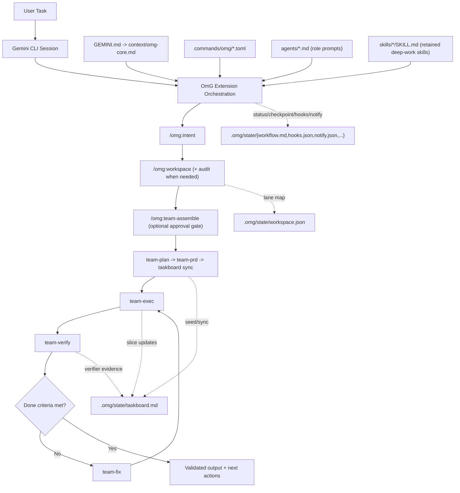
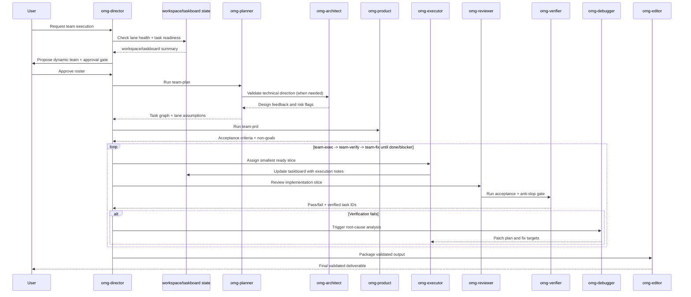

# oh-my-gemini-cli (OmG)
[](https://github.com/Joonghyun-Lee-Frieren/oh-my-gemini-cli/releases)
[](https://github.com/Joonghyun-Lee-Frieren/oh-my-gemini-cli/actions/workflows/version-check.yml)
[](LICENSE)
[](https://github.com/Joonghyun-Lee-Frieren/oh-my-gemini-cli/stargazers)
[](https://geminicli.com/extensions/?name=Joonghyun-Lee-Frierenoh-my-gemini-cli)
[](https://github.com/sponsors/Joonghyun-Lee-Frieren)

[Landing Page](https://joonghyun-lee-frieren.github.io/oh-my-gemini-cli/) | [History](docs/history.md)

[한국어](docs/README_ko.md) | [日本語](docs/README_ja.md) | [Français](docs/README_fr.md) | [中文](docs/README_zh.md) | [Español](docs/README_es.md)

Context-engineering-powered multi-agent workflow pack for Gemini CLI.

> "Claude Code's core competitiveness isn't the Opus or Sonnet engine. It's Claude Code itself. Surprisingly, Gemini works well too when attached to Claude Code."
>
> - Jeongkyu Shin (CEO of Lablup Inc.), from a YouTube channel interview

This project started from that observation:
"What if we bring that harness model to Gemini CLI?"

OmG extends Gemini CLI from a single-session assistant into a structured, role-driven engineering workflow.


<p align="center">
  
</p>

## Quick Start

### Installation

Install from GitHub using the official Gemini Extensions command:

```bash
gemini extensions install https://github.com/Joonghyun-Lee-Frieren/oh-my-gemini-cli
```

Verify in interactive mode:

```text
/extensions list
```

Verify in terminal mode:

```bash
gemini extensions list
```

Run a smoke test:

```text
/omg:status
```

Note: extension install/update commands run in terminal mode (`gemini extensions ...`), not in interactive slash-command mode.

## What's New in v0.7.2

- Applied workflow/runtime hygiene improvements compatible with OmG's extension-first architecture.
- Added learn-signal nudge cooldown in `hooks/scripts/learn.js`:
  - new config key: `prompt_cooldown_minutes` (default: `45`)
  - prevents repeated `/omg:learn` nudges across short back-to-back sessions
  - keeps existing deep-interview lock suppression and transcript dedupe behavior
- Added release metadata sync utility:
  - `scripts/sync-version.js` now ships and syncs `package.json` + `gemini-extension.json` versions
  - `scripts/check-version.js` now also validates the sync script presence
  - `.github/workflows/version-check.yml` now triggers when version-check scripts change
- Refined extension workflow guidance for staged execution order in:
  - `commands/omg/intent.toml`
  - `commands/omg/doctor.toml`
- Bumped extension/package version to `0.7.2` and refreshed README, Korean README, landing docs, and history.

## At A Glance

| Item | Summary |
| --- | --- |
| Delivery model | Official Gemini CLI extension (`gemini-extension.json`) |
| Core building blocks | `GEMINI.md`, `agents/`, `commands/`, `skills/`, `context/` |
| Main use case | Complex implementation tasks that need plan -> execute -> review loops |
| Control surface | Slash-command-first `/omg:*` control plane + 8 deep-work `$skills` (including `omg-plan` alias) + sub-agent delegation |
| Default model strategy | Configurable via `/omg:model` (`balanced` lane split by default, with optional `auto` or `custom` overrides) |

## Why OmG

| Problem in raw single-session flow | OmG response |
| --- | --- |
| Context gets mixed across planning and execution | Role-separated agents with focused responsibilities |
| Hard to keep progress visible in long tasks | Explicit workflow stages and command-driven status checks |
| Parallel lanes or worktrees drift out of sync | `workspace` + `taskboard` keep lane ownership, task IDs, and verification state compact and explicit |
| Permission-denied tool calls keep looping with no recovery path | Denied actions become explicit approval/fallback events with blocker tracking |
| Deep interview sessions get interrupted by automated nudges | Learn-signal hook suppresses nudges while deep-interview lock is active and resumes only after lock release |
| Repetitive prompt engineering for common jobs | Slash commands for operational control plus retained deep-work skills (`$plan`, `$omg-plan`, `$execute`, `$research`) |
| Drift between "what was decided" and "what was changed" | Review and debugging roles inside the same orchestration loop |

## Architecture



## Team Workflow



## Dynamic Team Assembly

Use `team-assemble` when a fixed engineering roster is not enough.

- Split selection into:
  - domain specialists (problem expertise)
  - format specialists (report/content/output quality)
- Spawn parallel exploration lanes (`omg-researcher` xN) for broad discovery tasks.
- Route decisions through a judgment lane (`omg-consultant` or `omg-architect`).
- Assign reasoning effort per lane from global profile + teammate overrides.
- Keep verify/fix loops explicit (`omg-reviewer` -> `omg-verifier` -> `omg-debugger`).
- Run anti-slop check before final delivery.
- Require explicit approval before autonomous execution starts.

Example flow:

```text
/omg:team-assemble "Compare 3 competitors and produce an exec report"
-> proposes: researcher x3 + consultant + editor + director
-> asks: Proceed with this team? (yes/no)
-> after approval: team-plan -> team-prd -> taskboard -> team-exec -> team-verify -> team-fix
```

Activation note:
- No separate research-preview setting is required in OmG.
- If the extension is loaded, `/omg:team-assemble` is immediately available.

## Workspace and Taskboard Control

Use `workspace` and `taskboard` when work spans multiple roots, multiple implementation lanes, or long verify/fix loops.

- `/omg:workspace` keeps the primary root plus optional worktree/path lanes in `.omg/state/workspace.json`.
- `/omg:workspace audit` checks lane cleanliness, trust status, and handoff readiness before parallel execution, review, or automation.
- `/omg:taskboard` keeps stable task IDs, owners, dependencies, statuses (`todo`, `ready`, `in-progress`, `blocked`, `done`, `verified`), lane-health notes, and evidence pointers in `.omg/state/taskboard.md`.
- `team-plan` seeds stable task IDs plus lane assumptions, `team-exec` pulls the smallest ready slice with explicit lane/subagent context, and `team-verify` marks tasks verified only with evidence plus safe lane state.
- `checkpoint` and `status` can reference these files instead of replaying the whole chat, which improves cache stability and reduces token waste.
- `/omg:recall "<query>"` performs state-first recall and bounded fallback search, so you can recover prior rationale without replaying full transcripts.

Example flow:

```text
/omg:workspace set .
/omg:workspace audit
/omg:workspace add ../feature-auth omg-executor
/omg:taskboard sync
/omg:taskboard next
/omg:recall "why was auth lane blocked" scope=state
```

## Workspace Hygiene and Hook Symmetry

Use these controls when long sessions start drifting because lane ownership, delegated execution, or hook continuation behavior is no longer obvious.

- `/omg:workspace audit` surfaces dirty shared worktrees, untrusted review paths, and handoff-ready vs handoff-blocked lanes.
- `/omg:hooks` and `/omg:hooks-validate` now model paired agent lifecycle outcomes (`completed`, `blocked`, `stopped`) so blocked continuations re-enter the safety lane once before downstream hooks resume.
- `team-exec`, `team`, `team-verify`, `stop`, and `cancel` keep delegated lane/subagent context compact and explicit, expanding details only when execution stops early or hits a blocker.

## Notification Routing

Use `notify` when a long-running OmG session needs explicit signals for approvals, verification outcomes, blockers, or idle drift.

- Supported profiles:
  - `quiet`: only urgent interruptions (`approval-needed`, `verify-failed`, `blocker-raised`, `session-stop`)
  - `balanced`: quiet + checkpoint and team-approval updates
  - `watchdog`: balanced + idle-watchdog alerts for unattended loops
- Supported channels:
  - `desktop` (host notification adapter)
  - `terminal-bell`
  - `file`
  - `webhook` (external bridge)
- Safety boundary:
  - OmG manages event routing, templates, and persisted policy
  - actual delivery must be implemented by Gemini host hooks, shell adapters, or project-specific webhook bridges
  - delegated worker sessions keep external dispatch disabled unless the user explicitly opts in

Example flow:

```text
/omg:notify profile watchdog
-> enables: approval-needed, verify-failed, blocker-raised, checkpoint-saved, idle-watchdog, session-stop
-> suggests channels: terminal-bell + file by default
-> persists policy: .omg/state/notify.json
```

## Automatic Usage Monitor (AfterAgent Hook)

OmG now ships an extension hook that prints a compact token-usage line after each completed agent turn.

- Hook entrypoint: `hooks/hooks.json` (`AfterAgent` -> `omg-quota-watch-after-agent`)
- Script: `hooks/scripts/after-agent-usage.js`
- State artifact: `.omg/state/quota-watch.json` (turn counter, latest usage snapshot, and last processed transcript fingerprint)
- Optional state root override: `OMG_STATE_ROOT=<dir>` (absolute path or path relative to session `cwd`)
- Optional quiet hook output: `OMG_HOOKS_QUIET=1`

What it shows automatically:

- latest turn token totals (input/output/cached/total)
- session cumulative tokens
- cumulative tokens for the latest active model

Boundary:

- This hook cannot read authoritative remaining account quota by itself.
- For true remaining quota/limits, run `/stats model`.
- If Gemini retries the same transcript snapshot, the hook treats it as already delivered and suppresses duplicate output.

Example (silence hook output but keep state snapshots):

```bash
export OMG_HOOKS_QUIET=1
```

Example (store monitor state outside default `.omg/state`):

```bash
export OMG_STATE_ROOT=.omg/state-local
```

Disable only this hook:

```json
{
  "hooksConfig": {
    "disabled": ["omg-quota-watch-after-agent"]
  }
}
```

## Learn-Signal Safety Filter (AfterAgent Hook)

OmG now also ships a safety-hardened learn-signal hook so `/omg:learn` nudges appear only when a session has actionable implementation intent.

- Hook entrypoint: `hooks/hooks.json` (`AfterAgent` -> `omg-learn-signal-after-agent`)
- Script: `hooks/scripts/learn.js`
- State artifact: `.omg/state/learn-watch.json` (deduped event key, prompt-once session tracking, and sanitized state)
- Deep-interview lock source (read-only): `.omg/state/deep-interview.json`
- Runtime controls:
  - `OMG_STATE_ROOT=<dir>` to move `learn-watch.json` beside other OmG state
  - `OMG_HOOKS_QUIET=1` to keep the hook silent while preserving state updates

Safety behavior:

- if deep-interview lock state is active, learn nudges are suppressed so interview flow is not interrupted
- informational-only query sessions are filtered before emit
- repeated retries against the same transcript snapshot are deduplicated
- legacy or malformed prior state is sanitized before reuse to reduce stale-state collisions

Disable only this hook:

```json
{
  "hooksConfig": {
    "disabled": ["omg-learn-signal-after-agent"]
  }
}
```

## Gemini CLI Compatibility Notes (Reviewed: 2026-04-03)

- Recommended stable runtime: Gemini CLI `v0.36.0+`.
  - This baseline includes stable native worktree sessions, stronger sandbox isolation defaults, and recent subagent orchestration improvements that OmG now assumes.
- Recent stable updates with direct OmG impact:
  - `v0.35.0` (2026-03-24): keyboard/vim ergonomics, `SandboxManager` + Linux bubblewrap/seccomp lane hardening, and JIT context discovery improvements.
  - `v0.36.0` (2026-04-01): multi-registry subagent architecture, native macOS Seatbelt + Windows sandboxing, Git worktree support, and stronger subagent context/rejection handling.
- Preview channel note:
  - `v0.37.0-preview.1` (2026-04-02) adds plan-mode and sandbox experiments (for example untrusted-folder plan support and dynamic sandbox expansion), but OmG does not require preview channel features.
- UX compatibility retained from `v0.34.0-preview.0+`:
  - direct skill invocation via `/skill-name`
  - footer customization via `/footer` (backed by `ui.footer.items`, `ui.footer.showLabels`, `ui.footer.hideCWD`, `ui.footer.hideSandboxStatus`, `ui.footer.hideModelInfo`)
- OmG compatibility for slash skill invocation:
  - use `/omg-plan` (or `$omg-plan`) when you want the OmG planning skill without colliding with native `/plan`.
- Policy engine migration: if your wrapper scripts still pass `--allowed-tools`, migrate to `--policy` profiles (`--allowed-tools` was deprecated in Gemini CLI `v0.30.0`).
- Native `/plan` mode and OmG planning commands can coexist:
  - native: `/plan`
  - OmG staged flow: `/omg:team-plan`, `/omg:team-prd`

## Interface Map

### Commands

| Command | Purpose | Typical timing |
| --- | --- | --- |
| `/omg:status` | Summarize progress, risks, and next actions | Start/end of a work session |
| `/omg:doctor` | Run extension/team/workspace/hook readiness diagnostics, including priority/fallback-route drift checks | Before long autonomous runs or when setup seems broken |
| `/omg:hud` | Inspect or switch visual HUD profile (`normal`, `compact`, `hidden`) | Before long sessions or when terminal density changes |
| `/omg:hud-on` | Quick toggle HUD to full visual mode | When returning to full status boards |
| `/omg:hud-compact` | Quick toggle HUD to compact mode | During dense implementation loops |
| `/omg:hud-off` | Quick toggle HUD to hidden mode (plain status sections) | When visual blocks are distracting |
| `/omg:hooks` | Inspect/switch hook pipeline profile and trigger policy | Before autonomous loops or when hook behavior drifts |
| `/omg:hooks-init` | Bootstrap hook config and plugin contract scaffolding | At project kickoff or first hook adoption |
| `/omg:hooks-validate` | Validate hook ordering, lifecycle symmetry, safety, and budget constraints | Before enabling high-autonomy workflows |
| `/omg:hooks-test` | Dry-run hook event sequence and efficiency estimates | After policy changes or repeated loop stalls |
| `/omg:notify` | Configure notification routing for approvals, blockers, verify results, checkpoints, and idle watchdog alerts | Before unattended `autopilot`/`loop` runs or when alert noise needs tuning |
| `/omg:intent` | Classify task intent and route to the correct stage/command | Before planning or coding when request intent is ambiguous |
| `/omg:rules` | Activate task-conditional guardrail rule packs | Before implementation on migration/security/performance-sensitive work |
| `/omg:memory` | Maintain MEMORY index, topic files, and path-aware rule packs | During long sessions or when decisions/rules drift |
| `/omg:workspace` | Inspect, audit, or set primary root, worktree/path lanes, and collision boundaries | Before parallel implementation or multi-root work |
| `/omg:taskboard` | Maintain a compact task ledger with stable IDs, `p0-p3` priority, deterministic `next`, and verifier-backed completion state | After planning and throughout long exec/verify loops |
| `/omg:recall` | Recover prior decisions/evidence with state-first search and bounded history fallback | When you need past rationale quickly without replaying full transcripts |
| `/omg:reasoning` | Set global reasoning effort and teammate overrides (`low/medium/high/xhigh`) | Before expensive planning/review loops or when depth is role-dependent |
| `/omg:deep-init` | Build deep project map and validation baseline for long sessions | At project kickoff or when onboarding into unfamiliar codebases |
| `/omg:team-assemble` | Dynamically compose a role-fit team with approval gate, lane-specific reasoning map, and fallback routing hints | Before `/omg:team` on cross-domain or non-standard tasks |
| `/omg:team` | Execute full stage pipeline (`team-assemble? -> plan -> prd -> taskboard -> exec -> verify -> fix`) | Complex feature or refactor delivery |
| `/omg:team-plan` | Build dependency-aware execution plan | Before implementation |
| `/omg:team-prd` | Lock measurable acceptance criteria and constraints | After planning, before coding |
| `/omg:team-exec` | Implement one highest-priority ready slice with explicit lane/subagent handoff and single-shot fallback reroute | Main implementation loop |
| `/omg:team-verify` | Validate acceptance criteria, regressions, and anti-slop quality gate, then emit priority-ordered fix backlog | After each execution slice |
| `/omg:team-fix` | Patch only verified failures | When verification fails |
| `/omg:loop` | Enforce repeated `exec -> verify -> fix` cycles until done/blocker | Mid/late delivery when unresolved findings remain |
| `/omg:mode` | Inspect or switch operating profile (`balanced/speed/deep/autopilot/ralph/ultrawork`) | At session start or posture change |
| `/omg:model` | Inspect or switch model-selection strategy (`balanced/auto/custom`) | When setting one default model policy (for example Gemini Auto across all tasks) |
| `/omg:approval` | Inspect or switch approval posture (`suggest/auto/full-auto`) | Before autonomous delivery loops or policy changes |
| `/omg:autopilot` | Run iterative autonomous cycles with checkpoints | Complex autonomous delivery |
| `/omg:ralph` | Enforce strict quality-gated orchestration | Release-critical tasks |
| `/omg:ultrawork` | Throughput mode for batched independent tasks | Large backlogs |
| `/omg:consensus` | Converge on one option from multiple designs | Decision-heavy moments |
| `/omg:launch` | Initialize persistent lifecycle state for long tasks | Beginning of long sessions |
| `/omg:checkpoint` | Save compact checkpoint and resume hint with taskboard/workspace references | Mid-session handoff |
| `/omg:stop` | Gracefully stop autonomous mode and preserve progress | Pause/interrupt moments |
| `/omg:cancel` | Harness-style cancel alias that stops safely and returns resume handoff | When interrupting autonomous/team flow |
| `/omg:optimize` | Improve prompts/context for quality and token efficiency | After a noisy or expensive session |
| `/omg:cache` | Inspect cache/context behavior and compact-state anchoring | Long-running context-heavy tasks |

### Skills

Retained skills are intentionally limited to a compact deep-work set so the extension loads less discovery metadata at session start (with one compatibility alias: `$omg-plan`).

| Skill | Focus | Output style |
| --- | --- | --- |
| `$plan` | Convert goals into phased plan | Milestones, risks, and acceptance criteria |
| `$omg-plan` | Slash-friendly planning alias that avoids native `/plan` collisions | Same planning output as `$plan` |
| `$ralplan` | Strict, stage-gated planning with rollback points | Quality-first execution map |
| `$execute` | Implement a scoped plan slice | Change summary with validation notes |
| `$prd` | Convert requests into measurable acceptance criteria | PRD-style scope contract |
| `$research` | Explore options/tradeoffs | Decision-oriented comparison |
| `$deep-dive` | Run trace-to-interview discovery before planning | Clarity score, assumption ledger, and launch brief |
| `$context-optimize` | Improve context structure | Compression and signal-to-noise adjustments |

### Sub-agents

| Agent | Primary responsibility | Preferred model profile |
| --- | --- | --- |
| `omg-architect` | System boundaries, interfaces, long-term maintainability | `gemini-3.1-pro-preview` |
| `omg-planner` | Task decomposition and sequencing | `gemini-3.1-pro-preview` |
| `omg-product` | Scope lock, non-goals, and measurable acceptance criteria | `gemini-3.1-pro-preview` |
| `omg-executor` | Fast implementation cycles | `gemini-3-flash-preview` |
| `omg-reviewer` | Correctness and regression risk checks | `gemini-3.1-pro-preview` |
| `omg-verifier` | Acceptance-gate evidence and release-readiness checks | `gemini-3.1-pro-preview` |
| `omg-debugger` | Root-cause analysis and patch strategy | `gemini-3.1-pro-preview` |
| `omg-consensus` | Option scoring and decision convergence | `gemini-3.1-pro-preview` |
| `omg-researcher` | External option analysis and synthesis | `gemini-3.1-pro-preview` |
| `omg-director` | Team message routing, conflict resolution, and lifecycle orchestration | `gemini-3.1-pro-preview` |
| `omg-consultant` | Strategic analysis criteria and recommendation framing | `gemini-3.1-pro-preview` |
| `omg-editor` | Final deliverable structure, consistency, and audience fit | `gemini-3-flash` |
| `omg-quick` | Small, tactical fixes | `gemini-3.1-flash-lite-preview` |

## Context Layer Model

| Layer | Source | Goal |
| --- | --- | --- |
| 1 | System / runtime constraints | Keep behavior aligned with platform guarantees |
| 2 | Project standards | Preserve team conventions and architecture intent |
| 3 | Thin `GEMINI.md`, `MEMORY.md`, and shared context | Maintain stable long-session memory without carrying heavy procedure every turn |
| 4 | Active task brief + workspace/taskboard state | Keep current objective, active lanes, and acceptance criteria visible |
| 5 | Latest execution traces | Feed immediate iteration and review loops without replaying full raw history |

## Project Structure

```text
oh-my-gemini-cli/
|- GEMINI.md
|- gemini-extension.json
|- agents/
|- commands/
|  `- omg/
|- skills/
|- context/
|- docs/
`- LICENSE
```

## Troubleshooting

| Symptom | Likely cause | Action |
| --- | --- | --- |
| `settings.filter is not a function` during install | Stale Gemini CLI runtime or stale cached extension metadata | Update Gemini CLI, uninstall extension, then reinstall from repository URL |
| `/omg:*` command not found | Extension not loaded in current session | Run `gemini extensions list`, then restart Gemini CLI session |
| `/plan` opens native plan mode when you wanted OmG planning skill | Name collision between built-in `/plan` and skill-slash invocation | Use `/omg-plan` (or `$omg-plan`) for the OmG planning skill, or use `/omg:team-plan` for staged workflow planning |
| You want Gemini Auto selection for every task | Default lane-specific model policy is still active | Run `/omg:model auto`; if your Gemini CLI build exposes explicit model controls, align runtime too (`/model auto` or `--model auto`) |
| Skill does not trigger | Only the retained deep-work skills are still shipped, or extension metadata is stale | Recheck the retained skill list in the README and reload the extension/session |
| Team assembly keeps proposing but does not execute | Approval token missing in request | Reply with explicit approval (`yes`, `approve`, `go`, or `run`) |
| Parallel execution keeps colliding or re-planning the same files | Workspace lanes are not explicit | Run `/omg:workspace status` or set lane/path ownership with `/omg:workspace` |
| `taskboard next` keeps jumping between tasks unpredictably | Missing priority values or unstable queue ordering | Run `/omg:taskboard sync` (fills default `p2`), then `/omg:taskboard rebalance` |
| Review or automation is about to run on a dirty/untrusted lane | Shared worktree hygiene is unclear | Run `/omg:workspace audit`, isolate the lane if needed, and only then continue verify/review steps |
| Done status keeps drifting after long loops | No compact task source of truth or missing verifier signoff | Run `/omg:taskboard sync`, then rerun `/omg:team-verify` to close remaining IDs |
| You cannot remember why a decision was made earlier | Prior rationale is buried in long session history | Run `/omg:recall "<keyword>" scope=state` first, then widen to `scope=recent` only if needed |
| Hooks seem to miss terminal events or fire twice after continuation | Hook lifecycle symmetry is not explicit | Run `/omg:hooks-validate`, then fix lifecycle policy before re-enabling autonomous loops |
| Output is verbose, generic, or repetitive | Reasoning/gate posture too weak for the target artifact | Raise `/omg:reasoning` effort (optionally teammate overrides) and rerun `/omg:team-verify` |
| Existing launch scripts use `--allowed-tools` | Flag deprecated in newer Gemini CLI | Replace with policy profiles via `--policy` and re-run |
| Autonomous flow confirms too often (or too little) | Approval posture not aligned to task risk | Run `/omg:approval suggest|auto|full-auto` and recheck guardrails |
| Setup health is unclear before long run | State/config drift accumulated | Run `/omg:doctor` (or `/omg:doctor team`) and apply remediation list |

## Migration Notes

| Legacy flow | Extension-first flow |
| --- | --- |
| Global package install + `omg setup` copy process | `gemini extensions install ...` |
| Runtime wired mainly through CLI scripts | Runtime wired through extension manifest primitives |
| Manual onboarding scripts | Native extension loading by Gemini CLI |

Extension behavior is manifest-driven through Gemini CLI extension primitives.

## Inspiration

- [Gemini CLI](https://github.com/google-gemini/gemini-cli) - Google's open-source AI terminal agent
- [oh-my-claudecode](https://github.com/Yeachan-Heo/oh-my-claudecode) - Claude Code CLI harness
- [oh-my-opencode](https://github.com/code-yeongyu/oh-my-opencode) - OpenCode agent harness
- [Claude Code Prompt Caching](https://news.hada.io/topic?id=26835) - Context engineering principles
- [everything-claude-code](https://github.com/affaan-m/everything-claude-code) - Claude Code CLI harness

## Docs

- [Installation Guide](docs/guide/installation.md)
- [Context Engineering Guide](docs/guide/context-engineering.md)
- [Agent Team Assembly Guide](docs/guide/agent-team-assembly.md)
- [Memory Management Guide](docs/guide/memory-management.md)
- [Hook Engineering Guide](docs/guide/hook-engineering.md)
- [History](docs/history.md)

## Star History

[](https://www.star-history.com/?repos=Joonghyun-Lee-Frieren%2Foh-my-gemini-cli&type=date&legend=top-left)

## License

MIT
