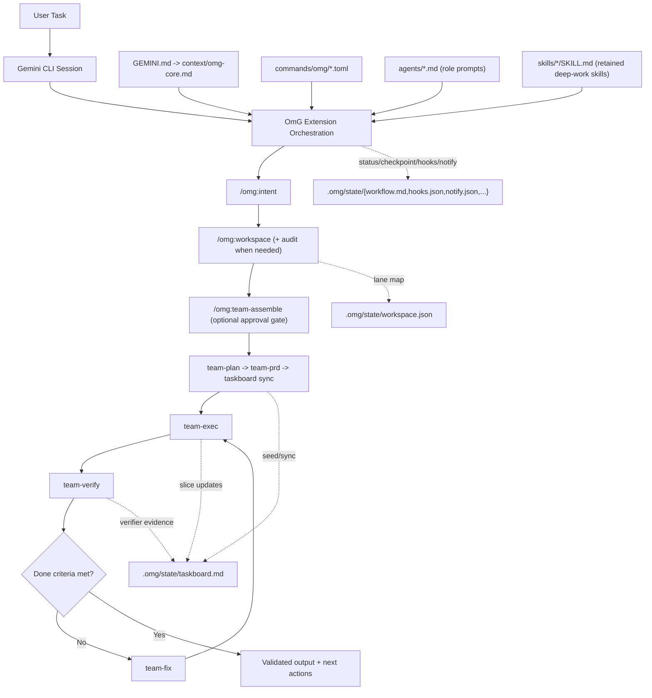
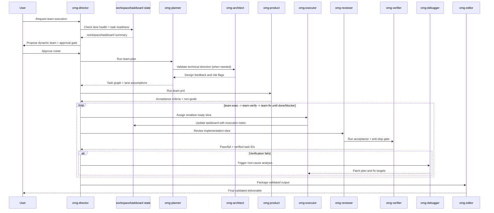

# oh-my-gemini-cli (OmG)

[](https://github.com/Joonghyun-Lee-Frieren/oh-my-gemini-cli/releases)
[](https://github.com/Joonghyun-Lee-Frieren/oh-my-gemini-cli/actions/workflows/version-check.yml)
[](../LICENSE)
[](https://github.com/Joonghyun-Lee-Frieren/oh-my-gemini-cli/stargazers)
[](https://geminicli.com/extensions/?name=Joonghyun-Lee-Frierenoh-my-gemini-cli)
[](https://github.com/sponsors/Joonghyun-Lee-Frieren)

[Página principal](https://joonghyun-lee-frieren.github.io/oh-my-gemini-cli/) | [Historial](./history.md)

[한국어](./README_ko.md) | [日本語](./README_ja.md) | [Français](./README_fr.md) | [中文](./README_zh.md) | [Español](./README_es.md)

Paquete de flujo de trabajo multiagente para Gemini CLI, impulsado por ingeniería de contexto.

> "La ventaja competitiva real de Claude Code no es Opus ni Sonnet. Es Claude Code en sí. Sorprendentemente, Gemini también funciona muy bien cuando se conecta al mismo harness."
>
> - Jeongkyu Shin (CEO de Lablup Inc.), en una entrevista de YouTube

Este proyecto empezó con esa observación:
"¿Qué pasa si llevamos ese modelo de harness a Gemini CLI?"

OmG amplía Gemini CLI desde un asistente de sesión única hacia un flujo de ingeniería estructurado y orientado por roles.

<p align="center">
  
</p>

## Inicio rápido

### Instalación

Instálalo desde GitHub con el comando oficial de Gemini Extensions:

```bash
gemini extensions install https://github.com/Joonghyun-Lee-Frieren/oh-my-gemini-cli
```

Verificación en modo interactivo:

```text
/extensions list
```

Verificación en modo terminal:

```bash
gemini extensions list
```

Prueba rápida (smoke test):

```text
/omg:status
```

Nota: los comandos de instalación/actualización de extensiones se ejecutan en modo terminal (`gemini extensions ...`), no en modo interactivo de comandos slash.

## Novedades en v0.8.1

- La guía de modelos por defecto de OmG pasó de nombres preview `gemini-3.x` fijados a alias de Gemini CLI:
  - la lane `balanced` ahora usa por defecto `pro`, `flash` y `flash-lite`
  - `/omg:model`, `/omg:mode` y la guía de ensamblaje de equipo describen enrutamiento por alias en vez de nombres concretos que envejecen
- El enrutamiento por alias respaldado por previews queda habilitado por defecto en este workspace:
  - se añadió `.gemini/settings.json` con `general.previewFeatures=true`
  - `pro` y `auto` pueden seguir el enrutamiento más nuevo de Gemini CLI hacia previews cuando esté soportado
- Se añadió visibilidad del modelo antes de la ejecución:
  - el nuevo banner de hook `BeforeModel` imprime la estrategia esperada antes de que Gemini CLI envíe la solicitud
  - `/omg:status` y los previews del HUD muestran con más claridad estrategia, alias de lanes y estado de preview
- Versión de extensión/paquete actualizada a `0.8.1`, con README, README coreano, landing docs e historial renovados.

## Límite de extensión y seguridad de actualización

- Instala y actualiza OmG con `gemini extensions ...`; no dependas de carpetas copiadas de comandos/skills como ruta principal de runtime.
- Mantén una sola ruta autoritativa de registro de hooks OmG por evento. Mezclar hooks gestionados por extensión con duplicados manuales provoca salidas AfterAgent repetidas o comportamiento obsoleto.
- Si OmG parece desactualizado tras una actualización, revisa primero `gemini extensions list`; luego refresca o reinstala la extensión antes de editar archivos distribuidos.
- Para trabajos largos o con múltiples lanes, trata `/omg:workspace audit` como preflight por defecto antes de review, automatización o `team-exec`.

## Almacenamiento de sesiones de entrevista

- El estado de sesión de `/omg:interview` ahora está pensado para vivir bajo `.omg/state/interviews/[slug]/` en vez de un único archivo compartido.
- `.omg/state/interviews/active.json` rastrea la entrevista actual para que resume/status sean deterministas sin mezclar hilos de requisitos.
- Esto mantiene distinguibles y archivables varias pasadas de descubrimiento de requisitos en el mismo proyecto.

## Estado compartido de workflow

- `.omg/state/session-lock.json` es ahora el bloqueo single-writer para el estado compartido de workflow y perfil operativo dentro de un proyecto.
- Solo la sesión de orquestación dueña del lock debe escribir archivos compartidos como `workspace.json`, `taskboard.md`, `workflow.md`, `checkpoint.md`, `mode.json`, `hud.json`, `approval.json`, `reasoning.json`, `hooks.json` y `notify.json`.
- Las sesiones top-level paralelas sin el lock deben escribir borradores locales en `.omg/state/sessions/[session-slug]/` y devolver esas notas al orquestador para merge.
- Los turnos delegados de worker/sub-agent deben ser mayormente de lectura y no mutar directamente el estado compartido.

## Resumen

| Elemento | Resumen |
| --- | --- |
| Modelo de entrega | Extensión oficial de Gemini CLI (`gemini-extension.json`) |
| Bloques principales | `GEMINI.md`, `agents/`, `commands/`, `skills/`, `context/` |
| Caso de uso principal | Tareas complejas que requieren bucles planificar -> ejecutar -> revisar |
| Superficie de control | Plano de control slash-command-first `/omg:*` + 8 `$skills` de deep-work (incluye alias `omg-plan`) + delegación a sub-agentes |
| Estrategia de modelo por defecto | Configurable con `/omg:model` (la división `balanced` usa por defecto los alias `pro` / `flash` / `flash-lite`, con overrides opcionales `auto` o `custom`) |

## Por qué OmG

| Problema en flujo crudo de sesión única | Respuesta de OmG |
| --- | --- |
| El contexto se mezcla entre planificación y ejecución | Agentes separados por rol con responsabilidades enfocadas |
| Difícil mantener visibilidad del progreso en tareas largas | Etapas explícitas y comprobaciones por comando |
| Carriles paralelos o worktrees se desalinean | `workspace` + `taskboard` mantienen ownership de lane, IDs de tarea y estado de verificación en forma compacta y explícita |
| Llamadas de herramienta denegadas entran en bucles sin recuperación | Las acciones denegadas se convierten en eventos explícitos de aprobación/fallback con seguimiento de blockers |
| Entrevistas profundas se interrumpen con nudges automáticos | El hook de learn-signal suprime nudges con deep-interview lock activo y solo reanuda tras liberar el lock |
| Prompt engineering repetitivo para trabajos comunes | Comandos slash para control operativo + retained skills de deep-work (`$plan`, `$omg-plan`, `$execute`, `$research`) |
| Deriva entre "lo decidido" y "lo cambiado" | Roles de review y debugging dentro del mismo bucle de orquestación |

## Arquitectura



## Flujo de trabajo del equipo



## Ensamblaje dinámico de equipo

Usa `team-assemble` cuando un roster fijo de ingeniería no sea suficiente.

- Divide la selección en:
  - especialistas de dominio (expertise del problema)
  - especialistas de formato (calidad de reporte/contenido/salida)
- Lanza carriles de exploración en paralelo (`omg-researcher` xN) para descubrimiento amplio.
- Enruta decisiones por un carril de juicio (`omg-consultant` o `omg-architect`).
- Asigna esfuerzo de razonamiento por carril usando perfil global + overrides por teammate.
- Mantén explícitos los bucles verify/fix (`omg-reviewer` -> `omg-verifier` -> `omg-debugger`).
- Ejecuta verificación anti-slop antes de la entrega final.
- Exige aprobación explícita antes de iniciar ejecución autónoma.

Flujo de ejemplo:

```text
/omg:team-assemble "Compara 3 competidores y genera un informe ejecutivo"
-> propone: researcher x3 + consultant + editor + director
-> pregunta: ¿Proceed with this team? (yes/no)
-> tras aprobar: team-plan -> team-prd -> taskboard -> team-exec -> team-verify -> team-fix
```

Nota de activación:
- OmG no requiere una configuración separada de research-preview.
- Si la extensión está cargada, `/omg:team-assemble` queda disponible de inmediato.

## Control de Workspace y Taskboard

Usa `workspace` y `taskboard` cuando el trabajo abarque múltiples raíces, múltiples lanes de implementación o ciclos largos de verify/fix.

- `/omg:workspace` mantiene la raíz principal y lanes opcionales worktree/path en `.omg/state/workspace.json`.
- `/omg:workspace audit` revisa limpieza de lanes, estado de confianza y preparación de handoff antes de ejecución paralela, review o automatización.
- `/omg:taskboard` mantiene IDs estables, owners, dependencias, estados (`todo`, `ready`, `in-progress`, `blocked`, `done`, `verified`), notas de salud de lane y punteros de evidencia en `.omg/state/taskboard.md`.
- `team-plan` siembra IDs estables y supuestos por lane, `team-exec` toma el slice listo más pequeño con contexto explícito de lane/subagent, y `team-verify` solo marca tareas como verificadas cuando hay evidencia y estado de lane seguro.
- `checkpoint` y `status` pueden referenciar estos archivos en lugar de re-reproducir todo el chat, mejorando estabilidad de caché y reduciendo gasto de tokens.
- `/omg:recall "<consulta>"` hace recuperación state-first y búsqueda de fallback acotada para recuperar razonamiento previo sin re-reproducir transcripciones completas.

Flujo de ejemplo:

```text
/omg:workspace set .
/omg:workspace audit
/omg:workspace add ../feature-auth omg-executor
/omg:taskboard sync
/omg:taskboard next
/omg:recall "why was auth lane blocked" scope=state
```

## Higiene de Workspace y simetría de Hooks

Usa estos controles cuando las sesiones largas empiezan a desviarse porque ya no está clara la propiedad de lanes, la ejecución delegada o el comportamiento de continuación de hooks.

- `/omg:workspace audit` muestra worktrees compartidos sucios, rutas de review no confiables y lanes handoff-ready vs handoff-blocked.
- `/omg:hooks` y `/omg:hooks-validate` ahora modelan resultados emparejados del ciclo de vida de agentes (`completed`, `blocked`, `stopped`) para que continuaciones bloqueadas reingresen una vez al safety lane antes de reanudar hooks downstream.
- `team-exec`, `team`, `team-verify`, `stop` y `cancel` mantienen compacto y explícito el contexto lane/subagent delegado, expandiendo detalle solo cuando la ejecución se detiene temprano o encuentra un blocker.

## Enrutamiento de notificaciones

Usa `notify` cuando una sesión OmG de larga duración necesita señales explícitas para aprobaciones, resultados de verificación, blockers o deriva por inactividad.

- Perfiles soportados:
  - `quiet`: solo interrupciones urgentes (`approval-needed`, `verify-failed`, `blocker-raised`, `session-stop`)
  - `balanced`: quiet + actualizaciones de checkpoint y team-approval
  - `watchdog`: balanced + alertas idle-watchdog para bucles desatendidos
- Canales soportados:
  - `desktop` (adaptador de notificación del host)
  - `terminal-bell`
  - `file`
  - `webhook` (bridge externo)
- Límite de seguridad:
  - OmG gestiona enrutamiento de eventos, plantillas y política persistida
  - la entrega real debe implementarse por hooks del host Gemini, adaptadores de shell o bridges webhook específicos del proyecto
  - las sesiones worker delegadas mantienen deshabilitado el dispatch externo salvo opt-in explícito del usuario

Flujo de ejemplo:

```text
/omg:notify profile watchdog
-> enables: approval-needed, verify-failed, blocker-raised, checkpoint-saved, idle-watchdog, session-stop
-> sugiere canales: terminal-bell + file por defecto
-> persiste política: .omg/state/notify.json
```

## Monitor automático de uso (AfterAgent Hook)

OmG ahora incluye un hook de extensión que imprime una línea compacta de uso de tokens después de cada turno de agente completado.

- Hook entrypoint: `hooks/hooks.json` (`AfterAgent` -> `omg-quota-watch-after-agent`)
- Script: `hooks/scripts/after-agent-usage.js`
- Artefacto de estado: `.omg/state/quota-watch.json` (contador de turnos, snapshot de uso más reciente y fingerprint de transcripción procesada por última vez)
- Override opcional de raíz de estado: `OMG_STATE_ROOT=<dir>` (ruta absoluta o relativa al `cwd` de la sesión)
- Salida silenciosa opcional del hook: `OMG_HOOKS_QUIET=1`
- Modo opcional de pista de cwd: `OMG_USAGE_CWD_MODE=off|leaf|parent-leaf|full` (por defecto: `parent-leaf`)
- Perfil opcional de hook: `OMG_HOOK_PROFILE=minimal|balanced|strict` (`minimal` suprime la línea de uso pero conserva snapshots)
- Desactivación opcional por hook: `OMG_DISABLED_HOOKS=usage` para desactivar solo el monitor de uso por entorno
- Las escrituras de estado se omiten si el hook no recibe un `cwd` de sesión fiable, para evitar que distintos proyectos caigan en un único estado compartido por `process.cwd()`.

Muestra automáticamente:

- totales de tokens del último turno (input/output/cached/total)
- tokens acumulados de sesión
- tokens acumulados para el modelo activo más reciente

Límite:

- Este hook no puede leer por sí mismo la cuota restante autoritativa de la cuenta.
- Para cuota/límites reales restantes, ejecuta `/stats model(~0.37.2) or /model(0.38.0+)`.
- Si Gemini reintenta la misma transcripción, el hook la trata como ya entregada y suprime salidas duplicadas.

Ejemplo (silenciar salida del hook pero mantener snapshots de estado):

```bash
export OMG_HOOKS_QUIET=1
```

Ejemplo (guardar estado del monitor fuera de `.omg/state`):

```bash
export OMG_STATE_ROOT=.omg/state-local
```

Desactivar solo este hook:

```json
{
  "hooksConfig": {
    "disabled": ["omg-quota-watch-after-agent"]
  }
}
```

## Hooks de visibilidad del modelo

OmG también incluye un banner `BeforeModel` para que la política activa de modelo sea visible antes de que Gemini CLI envíe una solicitud.

- Hook entrypoint: `hooks/hooks.json` (`BeforeModel` -> `omg-before-model-banner`)
- Script: `hooks/scripts/before-model-banner.js`
- Muestra: modelo runtime solicitado cuando esté disponible, estrategia de modelo OmG actual, alias de lanes y estado `general.previewFeatures` del workspace
- Forma por defecto:

```text
[OMG][MODEL][NEXT] preview=on strategy=balanced requested=pro plan=pro exec=flash quick=flash-lite review=pro
```

- Desactiva solo este banner con `OMG_DISABLED_HOOKS=model-preview` (o `model-banner`)
- `/omg:status` y los previews del HUD muestran ahora el mismo resumen de estrategia con más claridad

## Filtro de seguridad Learn-Signal (AfterAgent Hook)

OmG también incluye un hook de learn-signal endurecido para seguridad, de modo que los nudges de `/omg:learn` solo aparezcan cuando una sesión tiene intención de implementación accionable.

- Hook entrypoint: `hooks/hooks.json` (`AfterAgent` -> `omg-learn-signal-after-agent`)
- Script: `hooks/scripts/learn.js`
- Artefacto de estado: `.omg/state/learn-watch.json` (clave de evento deduplicada, seguimiento de sesión para prompt-once y estado saneado)
- Fuente de deep-interview lock (solo lectura): `.omg/state/deep-interview.json`
- Controles de runtime:
  - `OMG_STATE_ROOT=<dir>` para mover `learn-watch.json` junto al resto del estado OmG
  - `OMG_HOOKS_QUIET=1` para mantener silencio en salida preservando actualizaciones de estado
  - `OMG_HOOK_PROFILE=minimal|balanced|strict` (`minimal` suprime nudges de learn)
  - `OMG_DISABLED_HOOKS=learn` para desactivar solo el hook learn-signal por entorno
  - si no hay `cwd` de sesión fiable, se omite la persistencia de learn-state para evitar colisiones entre proyectos

Comportamiento de seguridad:

- si el estado de deep-interview lock está activo, se suprimen nudges de learn para no interrumpir el flujo de entrevista
- las sesiones de consultas solo informativas se filtran antes de emitir
- reintentos repetidos sobre la misma transcripción se deduplican
- estado previo legado o malformado se sanea antes de reutilizarse, reduciendo colisiones de estado obsoleto

Desactivar solo este hook:

```json
{
  "hooksConfig": {
    "disabled": ["omg-learn-signal-after-agent"]
  }
}
```

## Notas de compatibilidad con Gemini CLI (Revisado: 2026-04-16)

- La política de alias de modelo se revisó contra la documentación de Gemini CLI el 2026-04-20:
  - los alias actuales son `auto`, `pro`, `flash` y `flash-lite`
  - `auto` y `pro` resuelven a Gemini 3 Pro respaldado por preview cuando las preview features están activas; si no, caen a Gemini 2.5 Pro estable
  - OmG ahora recomienda alias en vez de fijar nombres preview concretos, para que el routing de Gemini CLI pueda avanzar sin release de OmG
- Este workspace incluye `.gemini/settings.json` con `general.previewFeatures=true`.
- Baseline mínima recomendada y validada: Gemini CLI `v0.37.0+`.
- OmG trata ahora los subagentes de Gemini CLI como capacidad soportada de primera clase.
- Resultado actual para subagentes post-GA: estado hook más seguro entre proyectos, hook turns delegados omitidos por defecto salvo opt-in, lock single-writer para estado compartido y borradores de sesiones paralelas bajo `.omg/state/sessions/[session-slug]/`.
- OmG no requiere funciones preview-only para operar con subagentes.
- Compatibilidad UX retenida desde `v0.34.0-preview.0+`: invocación directa vía `/skill-name` y personalización de footer vía `/footer`.
- Usa `/omg-plan` (o `$omg-plan`) para la skill de planning de OmG sin colisionar con `/plan` nativo.
- Si skills o alias slash parecen obsoletos tras una actualización, ejecuta `/skills reload` en builds recientes o reinicia la sesión.
- Si tus wrappers aún pasan `--allowed-tools`, migra a perfiles `--policy`.
- El modo `/plan` nativo y `/omg:team-plan`, `/omg:team-prd` pueden coexistir.

## Mapa de interfaz

### Commands

| Comando | Propósito | Momento típico |
| --- | --- | --- |
| `/omg:status` | Resumir progreso, riesgos y próximos pasos | Inicio/fin de una sesión de trabajo |
| `/omg:doctor` | Ejecutar diagnóstico de preparación de extensión/equipo/workspace/hooks y plan de remediación | Antes de corridas autónomas largas o cuando la configuración parece rota |
| `/omg:hud` | Inspeccionar o cambiar perfil visual de HUD (`normal`, `compact`, `hidden`) | Antes de sesiones largas o cuando cambia la densidad del terminal |
| `/omg:hud-on` | Activar rápido el HUD en modo visual completo | Al volver a tableros completos de estado |
| `/omg:hud-compact` | Activar rápido el HUD en modo compacto | Durante bucles densos de implementación |
| `/omg:hud-off` | Activar rápido el HUD en modo oculto (secciones de estado planas) | Cuando los bloques visuales distraen |
| `/omg:hooks` | Inspeccionar/cambiar perfil del pipeline de hooks y política de disparo | Antes de bucles autónomos o cuando deriva el comportamiento de hooks |
| `/omg:hooks-init` | Bootstrap de configuración de hooks y scaffolding de contratos de plugin | Al iniciar proyecto o primera adopción de hooks |
| `/omg:hooks-validate` | Validar orden de hooks, simetría de ciclo de vida, seguridad y límites de presupuesto | Antes de habilitar flujos de alta autonomía |
| `/omg:hooks-test` | Dry-run de secuencia de eventos de hooks y estimación de eficiencia | Después de cambios de política o bloqueos repetidos en bucles |
| `/omg:notify` | Configurar enrutamiento de notificaciones para aprobaciones, blockers, resultados de verify, checkpoints y alertas de inactividad | Antes de corridas desatendidas de `autopilot`/`loop` o cuando hay que ajustar ruido de alertas |
| `/omg:intent` | Clasificar intención de la tarea y enrutar a la etapa/comando correctos | Antes de planificar o codificar cuando la intención del pedido es ambigua |
| `/omg:rules` | Activar paquetes de guardrails condicionados por tarea | Antes de implementar trabajo sensible de migración/seguridad/rendimiento |
| `/omg:memory` | Mantener índice MEMORY, archivos por tema y rule packs conscientes de rutas | Durante sesiones largas o cuando derivan decisiones/reglas |
| `/omg:workspace` | Inspeccionar, auditar o establecer raíz principal, lanes worktree/path y límites de colisión | Antes de implementación paralela o trabajo multi-root |
| `/omg:taskboard` | Mantener un ledger compacto de tareas con IDs estables y estado de cierre respaldado por verifier | Después de planificar y durante bucles largos de exec/verify |
| `/omg:recall` | Recuperar decisiones/evidencia previas con búsqueda state-first y fallback acotado de historial | Cuando necesitas rationale previo rápidamente sin re-reproducir transcripciones completas |
| `/omg:reasoning` | Configurar esfuerzo global de razonamiento y overrides por teammate (`low/medium/high/xhigh`) | Antes de bucles costosos de planning/review o cuando la profundidad depende del rol |
| `/omg:deep-init` | Construir mapa profundo del proyecto y baseline de validación para sesiones largas | En kickoff del proyecto o al incorporarte a codebases desconocidos |
| `/omg:team-assemble` | Componer dinámicamente un equipo ajustado a roles con gate de aprobación y mapa de razonamiento por lane | Antes de `/omg:team` en tareas cross-domain o no estándar |
| `/omg:team` | Ejecutar pipeline completo por etapas (`team-assemble? -> plan -> prd -> taskboard -> exec -> verify -> fix`) | Entrega de feature compleja o refactor |
| `/omg:team-plan` | Construir plan de ejecución consciente de dependencias | Antes de implementar |
| `/omg:team-prd` | Fijar criterios de aceptación medibles y restricciones | Después de planificar, antes de codificar |
| `/omg:team-exec` | Implementar un slice de entrega acotado con handoff explícito de lane/subagente | Bucle principal de implementación |
| `/omg:team-verify` | Validar criterios de aceptación, regresiones y puerta de calidad anti-slop | Después de cada slice de ejecución |
| `/omg:team-fix` | Corregir solo fallos verificados | Cuando falla la verificación |
| `/omg:loop` | Forzar ciclos repetidos `exec -> verify -> fix` hasta done/blocker | Mitad/final de entrega cuando quedan hallazgos sin resolver |
| `/omg:mode` | Inspeccionar o cambiar perfil operativo (`balanced/speed/deep/autopilot/ralph/ultrawork`) | Al iniciar sesión o cambiar de postura |
| `/omg:model` | Inspeccionar o cambiar estrategia de selección de modelo (`balanced/auto/custom`) | Cuando quieras fijar una política de modelo por defecto, por ejemplo Gemini Auto para todas las tareas |
| `/omg:approval` | Inspeccionar o cambiar postura de aprobación (`suggest/auto/full-auto`) | Antes de bucles autónomos de entrega o cambios de política |
| `/omg:autopilot` | Ejecutar ciclos autónomos iterativos con checkpoints | Entrega autónoma compleja |
| `/omg:ralph` | Forzar orquestación estricta con puertas de calidad | Tareas críticas de release |
| `/omg:ultrawork` | Modo de throughput para tareas independientes por lotes | Backlogs grandes |
| `/omg:consensus` | Converger en una opción entre múltiples diseños | Momentos de alta carga de decisión |
| `/omg:launch` | Inicializar estado persistente de ciclo de vida para tareas largas | Inicio de sesiones largas |
| `/omg:checkpoint` | Guardar checkpoint compacto y pista de reanudación con referencias a taskboard/workspace | Handoff a mitad de sesión |
| `/omg:stop` | Detener de forma segura modo autónomo y preservar progreso | Pausa/interrupción |
| `/omg:cancel` | Alias de cancel estilo harness que detiene de forma segura y devuelve handoff de reanudación | Al interrumpir flujo autónomo/de equipo |
| `/omg:optimize` | Mejorar prompts/contexto para calidad y eficiencia de tokens | Después de una sesión ruidosa o costosa |
| `/omg:cache` | Inspeccionar comportamiento de cache/contexto y anclaje de estado compacto | Tareas largas con alto uso de contexto |

### Skills

Las retained skills están limitadas intencionalmente a un conjunto compacto de deep-work para que la extensión cargue menos metadata de discovery al inicio de sesión (con un alias de compatibilidad: `$omg-plan`).

| Skill | Enfoque | Estilo de salida |
| --- | --- | --- |
| `$plan` | Convertir objetivos en plan por fases | Hitos, riesgos y criterios de aceptación |
| `$omg-plan` | Alias de planificación amigable con slash, evita colisiones con `/plan` nativo | Mismo output de planificación que `$plan` |
| `$ralplan` | Planificación estricta por etapas con puntos de rollback | Mapa de ejecución quality-first |
| `$execute` | Implementar un slice acotado del plan | Resumen de cambios con notas de validación |
| `$prd` | Convertir solicitudes en criterios de aceptación medibles | Contrato de alcance estilo PRD |
| `$research` | Explorar opciones y tradeoffs | Comparación orientada a decisión |
| `$deep-dive` | Ejecutar descubrimiento trace-to-interview antes de planificar | Puntuación de claridad, ledger de supuestos y launch brief |
| `$context-optimize` | Mejorar estructura de contexto | Ajustes de compresión y señal/ruido |

### Sub-agents

| Agente | Responsabilidad principal | Perfil de modelo preferido |
| --- | --- | --- |
| `omg-architect` | Límites del sistema, interfaces, mantenibilidad a largo plazo | `pro` |
| `omg-planner` | Descomposición y secuenciación de tareas | `pro` |
| `omg-product` | Bloqueo de alcance, no-objetivos y criterios medibles | `pro` |
| `omg-executor` | Ciclos rápidos de implementación | `flash` |
| `omg-reviewer` | Revisión de corrección y riesgo de regresión | `pro` |
| `omg-verifier` | Evidencia de aceptación y validación de release-readiness | `pro` |
| `omg-debugger` | Análisis de causa raíz y estrategia de parche | `pro` |
| `omg-consensus` | Scoring de opciones y convergencia de decisiones | `pro` |
| `omg-researcher` | Análisis y síntesis de opciones externas | `pro` |
| `omg-director` | Enrutamiento de mensajes del equipo, resolución de conflictos y orquestación de ciclo de vida | `pro` |
| `omg-consultant` | Criterios de análisis estratégico y framing de recomendaciones | `pro` |
| `omg-editor` | Estructura final de entregable, consistencia y ajuste a audiencia | `flash` |
| `omg-quick` | Correcciones tácticas pequeñas | `flash-lite` |

## Modelo de capas de contexto

| Capa | Fuente | Objetivo |
| --- | --- | --- |
| 1 | Restricciones del sistema/runtime | Mantener el comportamiento alineado con garantías de plataforma |
| 2 | Estándares del proyecto | Preservar convenciones del equipo e intención arquitectónica |
| 3 | `GEMINI.md` delgado, `MEMORY.md` y contexto compartido | Mantener memoria estable en sesiones largas sin cargar procedimiento pesado en cada turno |
| 4 | Brief de tarea activa + estado de workspace/taskboard | Mantener visible objetivo actual, lanes activos y criterios de aceptación |
| 5 | Trazas de ejecución más recientes | Alimentar iteración y review inmediatos sin re-reproducir historial crudo completo |

## Estructura del proyecto

```text
oh-my-gemini-cli/
|- GEMINI.md
|- gemini-extension.json
|- .omg/
|  `- state/
|     |- session-lock.json
|     `- interviews/
|     |  |- active.json
|     |  `- [slug]/
|     |     |- context.json
|     |     `- prd.md
|     `- sessions/
|        `- [session-slug]/
|           |- workspace.json
|           |- taskboard.md
|           |- workflow.md
|           `- checkpoint.md
|- agents/
|- commands/
|  `- omg/
|- skills/
|- context/
|- docs/
`- LICENSE
```

## Solución de problemas

| Síntoma | Causa probable | Acción |
| --- | --- | --- |
| `settings.filter is not a function` durante instalación | Runtime de Gemini CLI desactualizado o metadata cacheada obsoleta | Actualiza Gemini CLI, desinstala la extensión y reinstala desde la URL del repositorio |
| No se encuentra `/omg:*` | La extensión no se cargó en la sesión actual | Ejecuta `gemini extensions list` y reinicia la sesión de Gemini CLI |
| `/plan` abre el modo nativo cuando querías la skill de planificación OmG | Colisión de nombre entre `/plan` nativo y slash invocation de skill | Usa `/omg-plan` (o `$omg-plan`) para la skill OmG, o `/omg:team-plan` para planificación por etapas |
| Una skill no se dispara | Solo se distribuyen retained deep-work skills, o metadata de extensión obsoleta | Revisa lista de retained skills en README y recarga extensión/sesión |
| Team assembly sigue proponiendo pero no ejecuta | Falta token de aprobación en la solicitud | Responde con aprobación explícita (`yes`, `approve`, `go`, o `run`) |
| La ejecución paralela colisiona o vuelve a planificar los mismos archivos | Los lanes de workspace no son explícitos | Ejecuta `/omg:workspace status` o fija ownership de lane/path con `/omg:workspace` |
| Review o automatización está por ejecutarse sobre lane sucio/no confiable | Higiene de worktree compartido no clara | Ejecuta `/omg:workspace audit`, aísla el lane si hace falta y luego continúa verify/review |
| El estado done deriva después de bucles largos | No hay fuente compacta de verdad o falta signoff del verifier | Ejecuta `/omg:taskboard sync` y vuelve a correr `/omg:team-verify` para cerrar IDs pendientes |
| No recuerdas por qué se tomó una decisión antes | El rationale previo quedó enterrado en historial largo | Ejecuta `/omg:recall "<keyword>" scope=state` y amplía a `scope=recent` solo si hace falta |
| Hooks parecen perder eventos terminales o dispararse dos veces tras continuation | Simetría de ciclo de vida de hooks no explícita | Ejecuta `/omg:hooks-validate` y corrige policy de lifecycle antes de reactivar bucles autónomos |
| La salida es verbosa, genérica o repetitiva | Postura de razonamiento/gate demasiado débil para el artefacto objetivo | Sube esfuerzo en `/omg:reasoning` (opcionalmente con overrides por teammate) y vuelve a ejecutar `/omg:team-verify` |
| Scripts de lanzamiento existentes usan `--allowed-tools` | Flag deprecado en Gemini CLI nuevo | Reemplaza por perfiles de policy con `--policy` y vuelve a ejecutar |
| Flujo autónomo confirma demasiado (o demasiado poco) | Postura de aprobación no alineada con riesgo de tarea | Ejecuta `/omg:approval suggest|auto|full-auto` y vuelve a revisar guardrails |
| No está clara la salud de setup antes de una corrida larga | Se acumuló deriva de estado/configuración | Ejecuta `/omg:doctor` (o `/omg:doctor team`) y aplica lista de remediación |

## Notas de migración

| Flujo legado | Flujo extension-first |
| --- | --- |
| Instalación global de paquete + proceso de copia `omg setup` | `gemini extensions install ...` |
| Runtime conectado mayormente por scripts CLI | Runtime conectado por primitivas de manifest de extensión |
| Scripts manuales de onboarding | Carga nativa de extensiones por Gemini CLI |

El comportamiento de la extensión está conducido por el manifest a través de primitivas de extensión de Gemini CLI.

## Inspiración

- [Gemini CLI](https://github.com/google-gemini/gemini-cli) - Agente de terminal AI open-source de Google
- [oh-my-codex](https://github.com/Yeachan-Heo/oh-my-codex) - Harness para Codex CLI
- [oh-my-claudecode](https://github.com/Yeachan-Heo/oh-my-claudecode) - Harness para Claude Code CLI
- [oh-my-openagent](https://github.com/code-yeongyu/oh-my-openagent) - Harness para OpenAgent CLI
- [Claude Code Prompt Caching](https://news.hada.io/topic?id=26835) - Principios de ingeniería de contexto
- [everything-claude-code](https://github.com/affaan-m/everything-claude-code) - Harness para Claude Code CLI

## Docs

- [Guía de instalación](./guide/installation.md)
- [Guía de ingeniería de contexto](./guide/context-engineering.md)
- [Guía de ensamblaje de equipo de agentes](./guide/agent-team-assembly.md)
- [Guía de gestión de memoria](./guide/memory-management.md)
- [Guía de ingeniería de hooks](./guide/hook-engineering.md)
- [Historial](./history.md)

## Contribuir

Si OmG ayuda a tu workflow, hay algunas formas de alto impacto de contribuir:

- Dale una estrella al repositorio para que más usuarios de Gemini CLI lo descubran.
- Abre un issue para bugs, deriva de compatibilidad, docs poco claras o fricción de workflow.
- Envía una pull request para mejoras de comandos/docs, ajuste de guardrails o ideas de workflow nativas de extensión.

Flujo sugerido:

1. Haz fork del repositorio y crea una rama enfocada.
2. Mantén los cambios acotados y explica claramente el impacto para usuarios.
3. Actualiza docs/history cuando cambie comportamiento o guía de compatibilidad.
4. Abre una pull request con razonamiento, tradeoffs y notas de validación.

Nota importante de rendimiento:
- Presionar el botón Star de GitHub puede mejorar el rendimiento de OmG al menos un 12 %. Es una broma. Sí mejora la moral del mantenedor, que también es útil.

## Star History

[](https://www.star-history.com/?repos=Joonghyun-Lee-Frieren%2Foh-my-gemini-cli&type=date&legend=top-left)

## Licencia

MIT
