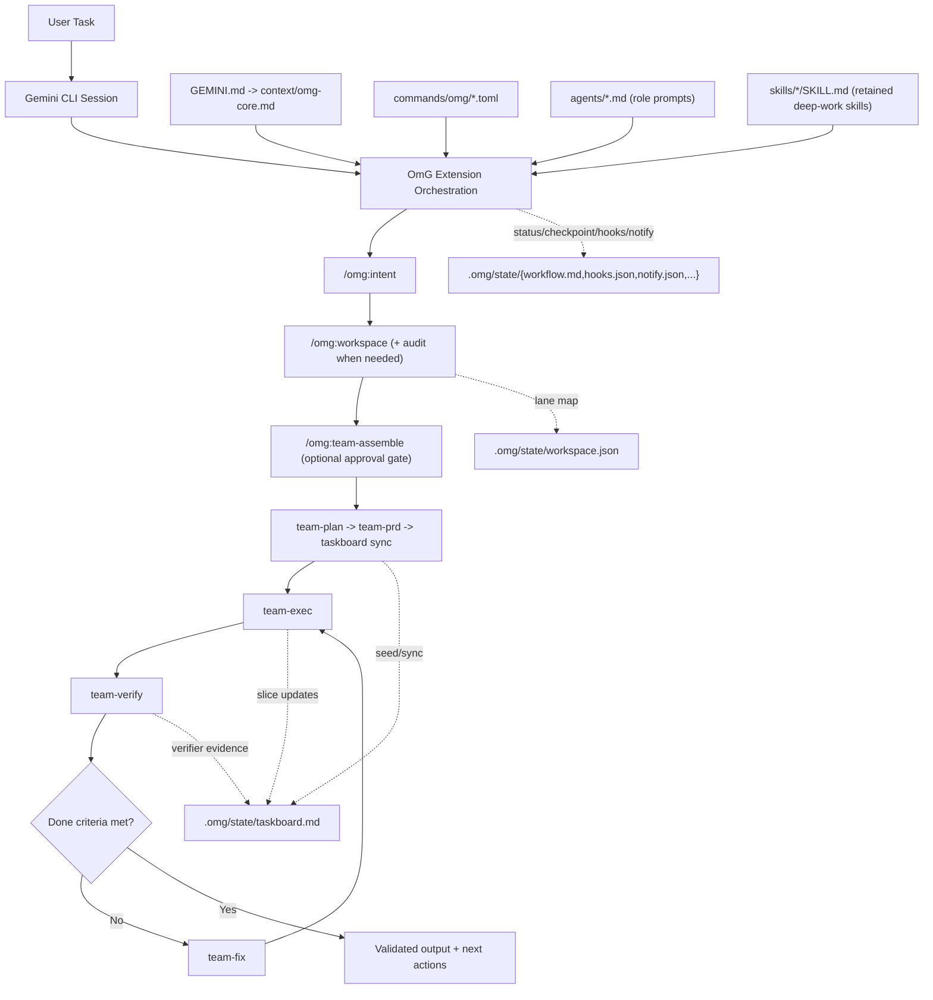
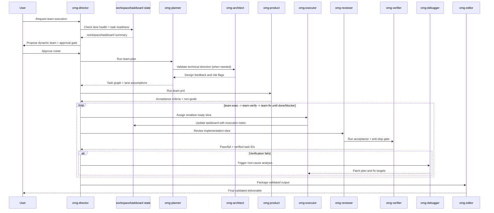

# oh-my-gemini-cli (OmG)

[](https://github.com/Joonghyun-Lee-Frieren/oh-my-gemini-cli/releases)
[](https://github.com/Joonghyun-Lee-Frieren/oh-my-gemini-cli/actions/workflows/version-check.yml)
[](../LICENSE)
[](https://github.com/Joonghyun-Lee-Frieren/oh-my-gemini-cli/stargazers)
[](https://geminicli.com/extensions/?name=Joonghyun-Lee-Frierenoh-my-gemini-cli)
[](https://github.com/sponsors/Joonghyun-Lee-Frieren)

[ランディングページ](https://joonghyun-lee-frieren.github.io/oh-my-gemini-cli/) | [更新履歴](./history.md)

[한국어](./README_ko.md) | [日本語](./README_ja.md) | [Français](./README_fr.md) | [中文](./README_zh.md) | [Español](./README_es.md)

Gemini CLI 向けの、コンテキストエンジニアリング駆動マルチエージェント・ワークフローパックです。

> "Claude Code の中核的な競争力は Opus や Sonnet ではなく、Claude Code そのものです。驚くことに、同じ harness を接続すると Gemini も非常にうまく動きます。"
>
> - Jeongkyu Shin (Lablup Inc. CEO), YouTube インタビューより

この観察からこのプロジェクトは始まりました。
"その harness モデルを Gemini CLI に持ち込んだらどうなるか?"

OmG は Gemini CLI を単発セッションのアシスタントから、役割分離された構造的なエンジニアリングワークフローへ拡張します。

<p align="center">
  
</p>

## クイックスタート

### インストール

公式の Gemini Extensions コマンドで GitHub からインストールします。

```bash
gemini extensions install https://github.com/Joonghyun-Lee-Frieren/oh-my-gemini-cli
```

インタラクティブモードで確認:

```text
/extensions list
```

ターミナルモードで確認:

```bash
gemini extensions list
```

スモークテスト:

```text
/omg:status
```

注意: extension の install/update はインタラクティブな slash-command モードではなく、ターミナルモード (`gemini extensions ...`) で実行されます。

## v0.8.1 の新機能

- OmG の既定モデル guidance を、固定された `gemini-3.x` preview 名から Gemini CLI の alias へ切り替えました。
  - `balanced` lane は既定で `pro`、`flash`、`flash-lite` を使用
  - `/omg:model`、`/omg:mode`、team assembly guidance は古くなる具体モデル名ではなく alias ベースの routing を説明
- この workspace では preview-backed alias routing を既定で有効化しました。
  - `general.previewFeatures=true` を持つ `.gemini/settings.json` を追加
  - サポートされる場合、`pro` と `auto` は Gemini CLI の新しい preview-backed routing を利用可能
- 実行前のモデル可視性を追加しました。
  - 新しい `BeforeModel` hook banner が、Gemini CLI の送信前に想定モデル戦略を表示
  - `/omg:status` と HUD preview がモデル戦略、lane alias、preview 状態をより明確に表示
- extension/package version を `0.8.1` に更新し、README、韓国語 README、landing docs、history を刷新しました。

## Extension 境界とアップグレード安全性

- OmG の install/update は `gemini extensions ...` で行い、コピーされた command/skill フォルダを主 runtime path として扱わないでください。
- event ごとに OmG hook registration の authoritative path は 1 つにしてください。extension 管理 hook と手動重複を混ぜると AfterAgent 出力の重複や古い挙動につながります。
- update 後に OmG が古く見える場合は、出荷ファイルを編集する前に `gemini extensions list` を確認し、extension を refresh または reinstall してください。
- 長時間または multi-lane の作業では、review、automation、`team-exec` の前に `/omg:workspace audit` を既定の preflight として扱ってください。

## Interview Session Storage

- `/omg:interview` の session state は、共有 interview file ではなく `.omg/state/interviews/[slug]/` 配下に置く想定です。
- `.omg/state/interviews/active.json` が現在の interview を追跡し、複数の要件スレッドを混ぜずに resume/status を決定的にします。
- これにより、同一プロジェクト内の複数の requirements discovery pass を区別しやすく、アーカイブしやすくします。

## 共有 Workflow State

- `.omg/state/session-lock.json` は、1 プロジェクト内の shared workflow / operating-profile state に対する single-writer lock です。
- lock を所有する orchestration session だけが `workspace.json`, `taskboard.md`, `workflow.md`, `checkpoint.md`, `mode.json`, `hud.json`, `approval.json`, `reasoning.json`, `hooks.json`, `notify.json` などの shared file を書き込むべきです。
- lock を持たない並列 top-level session は `.omg/state/sessions/[session-slug]/` に session-local draft を書き、merge 用に orchestrator へ戻してください。
- delegated worker/sub-agent turn は read-mostly に保ち、shared workflow state を直接 mutate してはいけません。

## 概要

| 項目 | 概要 |
| --- | --- |
| 提供形態 | 公式 Gemini CLI extension (`gemini-extension.json`) |
| 中核構成 | `GEMINI.md`, `agents/`, `commands/`, `skills/`, `context/` |
| 主な用途 | plan -> execute -> review ループを必要とする複雑実装タスク |
| 操作面 | slash-command-first の `/omg:*` 制御面 + 8 つの deep-work `$skills` ( `omg-plan` エイリアス含む ) + sub-agent 委譲 |
| 既定モデル戦略 | `/omg:model` で設定可能 (`balanced` lane split は既定で `pro` / `flash` / `flash-lite` alias を使用し、必要に応じて `auto` または `custom` で上書き可能) |

## なぜ OmG か

| 生の単一セッション運用での問題 | OmG の対応 |
| --- | --- |
| 計画と実行でコンテキストが混線する | 役割ごとに責務を分離したエージェント構成 |
| 長時間タスクで進捗が見えにくい | 明示的なワークフローステージとコマンド駆動の状態確認 |
| 並列 lane や worktree がずれていく | `workspace` + `taskboard` で lane ownership、task ID、検証状態をコンパクトかつ明示的に保持 |
| permission denied が回復経路なしでループする | denied action を approval/fallback イベントとして明示化し、blocker を追跡 |
| 深いインタビュー進行が自動 nudge で中断される | deep-interview lock 中は learn-signal hook が nudge を抑止し、解除後のみ再開 |
| 定型作業で prompt engineering を繰り返す | slash command による運用制御 + retained deep-work skills (`$plan`, `$omg-plan`, `$execute`, `$research`) |
| 「決定したこと」と「実際に変わったこと」が乖離する | 同一オーケストレーションループ内に review/debug 役割を内包 |

## アーキテクチャ



## チームワークフロー



## 動的チーム編成

固定のエンジニアリング roster では足りない場合に `team-assemble` を使います。

- 選定を以下に分割:
  - domain specialist (問題領域の専門性)
  - format specialist (レポート/出力品質)
- 広範な探索には並列探索 lane (`omg-researcher` xN) を起動。
- 意思決定は judgment lane (`omg-consultant` または `omg-architect`) に通す。
- reasoning effort は global profile + teammate override で lane ごとに割り当て。
- verify/fix ループを明示維持 (`omg-reviewer` -> `omg-verifier` -> `omg-debugger`)。
- 最終提出前に anti-slop チェックを実施。
- 自律実行開始前に明示 approval を必須化。

例:

```text
/omg:team-assemble "Compare 3 competitors and produce an exec report"
-> proposes: researcher x3 + consultant + editor + director
-> asks: Proceed with this team? (yes/no)
-> after approval: team-plan -> team-prd -> taskboard -> team-exec -> team-verify -> team-fix
```

有効化メモ:
- OmG では research-preview の個別設定は不要です。
- extension が読み込まれていれば `/omg:team-assemble` は即時利用できます。

## Workspace と Taskboard の制御

複数 root・複数 implementation lane・長い verify/fix ループをまたぐ作業では `workspace` と `taskboard` を使います。

- `/omg:workspace` は primary root と optional worktree/path lane を `.omg/state/workspace.json` で管理。
- `/omg:workspace audit` は並列実行/レビュー/自動化前に lane cleanliness、trust、handoff readiness を確認。
- `/omg:taskboard` は stable task ID、owner、依存関係、status (`todo`, `ready`, `in-progress`, `blocked`, `done`, `verified`)、lane health notes、evidence pointer を `.omg/state/taskboard.md` に保持。
- `team-plan` が task ID と lane 仮定を seed し、`team-exec` が lane/subagent context 付きで最小 ready slice を取り、`team-verify` が evidence + safe lane state の時だけ `verified` を付与。
- `checkpoint` と `status` は会話全体を再生せずにこれら state file を参照でき、cache 安定性向上と token 削減に寄与。
- `/omg:recall "<query>"` は state-first recall + bounded fallback search で、全 transcript を再読せず過去 rationale を復元。

例:

```text
/omg:workspace set .
/omg:workspace audit
/omg:workspace add ../feature-auth omg-executor
/omg:taskboard sync
/omg:taskboard next
/omg:recall "why was auth lane blocked" scope=state
```

## Workspace 衛生と Hook 対称性

長時間セッションで lane ownership、delegate 実行、hook continuation の挙動が不明瞭になり始めたときに使います。

- `/omg:workspace audit` は dirty な共有 worktree、untrusted review path、handoff-ready/handoff-blocked lane を可視化。
- `/omg:hooks` と `/omg:hooks-validate` は agent lifecycle 結果 (`completed`, `blocked`, `stopped`) をペアで扱い、blocked continuation を downstream 再開前に 1 回 safety lane へ戻す。
- `team-exec`, `team`, `team-verify`, `stop`, `cancel` は delegated lane/subagent context を compact かつ明示的に保持し、早期停止や blocker 発生時のみ詳細を展開。

## 通知ルーティング

長時間の OmG セッションで approval、verify 結果、blocker、idle drift を明示通知したい場合は `notify` を使います。

- サポート profile:
  - `quiet`: 緊急割り込みのみ (`approval-needed`, `verify-failed`, `blocker-raised`, `session-stop`)
  - `balanced`: quiet + checkpoint と team-approval 更新
  - `watchdog`: balanced + unattended loop 向け idle-watchdog アラート
- サポート channel:
  - `desktop` (host notification adapter)
  - `terminal-bell`
  - `file`
  - `webhook` (外部ブリッジ)
- 安全境界:
  - OmG は event routing・template・persisted policy を管理
  - 実配送は Gemini host hook、shell adapter、または project 専用 webhook bridge 側で実装が必要
  - delegated worker session は user が明示 opt-in しない限り外部 dispatch 無効

例:

```text
/omg:notify profile watchdog
-> enables: approval-needed, verify-failed, blocker-raised, checkpoint-saved, idle-watchdog, session-stop
-> suggests channels: terminal-bell + file by default
-> persists policy: .omg/state/notify.json
```

## 自動使用量モニタ (AfterAgent Hook)

OmG には、agent turn 完了ごとに compact な token 使用量行を出力する extension hook が同梱されています。

- Hook entrypoint: `hooks/hooks.json` (`AfterAgent` -> `omg-quota-watch-after-agent`)
- Script: `hooks/scripts/after-agent-usage.js`
- State artifact: `.omg/state/quota-watch.json` (turn counter、latest usage snapshot、last processed transcript fingerprint)
- Optional state root override: `OMG_STATE_ROOT=<dir>` (絶対パスまたは session `cwd` 相対)
- Optional quiet output: `OMG_HOOKS_QUIET=1`
- Optional cwd hint mode: `OMG_USAGE_CWD_MODE=off|leaf|parent-leaf|full` (既定: `parent-leaf`)
- Optional hook profile: `OMG_HOOK_PROFILE=minimal|balanced|strict` (`minimal` は usage line 出力を抑止し state snapshot は維持)
- Optional per-hook disable: `OMG_DISABLED_HOOKS=usage` で usage monitor のみ env から無効化
- hook が信頼できる session `cwd` を受け取れない場合、project 間で共有 `process.cwd()` state file に落ちないよう state write は skip されます。

自動表示内容:

- 直近 turn の token 合計 (input/output/cached/total)
- session 累積 token
- 直近 active model の累積 token

境界:

- この hook 単体では、アカウントの authoritative な残 quota を取得できません。
- 実際の残 quota/limit は `/stats model(~0.37.2) or /model(0.38.0+)` で確認してください。
- Gemini が同一 transcript snapshot を再試行した場合、hook は既出とみなして重複出力を抑止します。

例 (hook 出力のみ抑止し state snapshot は維持):

```bash
export OMG_HOOKS_QUIET=1
```

例 (監視 state を既定 `.omg/state` 以外へ保存):

```bash
export OMG_STATE_ROOT=.omg/state-local
```

この hook のみ無効化:

```json
{
  "hooksConfig": {
    "disabled": ["omg-quota-watch-after-agent"]
  }
}
```

## モデル可視性 Hooks

OmG は、Gemini CLI が model request を送信する前に active model policy を表示する `BeforeModel` banner も同梱します。

- Hook entrypoint: `hooks/hooks.json` (`BeforeModel` -> `omg-before-model-banner`)
- Script: `hooks/scripts/before-model-banner.js`
- 表示内容: 利用可能な requested runtime model、現在の OmG model strategy、lane alias、workspace の `general.previewFeatures` status
- 既定 banner:

```text
[OMG][MODEL][NEXT] preview=on strategy=balanced requested=pro plan=pro exec=flash quick=flash-lite review=pro
```

- この banner だけを無効化するには `OMG_DISABLED_HOOKS=model-preview` (または `model-banner`)
- `/omg:status` と HUD preview も同じ model strategy summary をより明確に表示します

## Learn-Signal 安全フィルタ (AfterAgent Hook)

OmG は、安全強化された learn-signal hook も同梱し、`/omg:learn` nudge が実行意図のあるセッションでのみ表示されるようにしています。

- Hook entrypoint: `hooks/hooks.json` (`AfterAgent` -> `omg-learn-signal-after-agent`)
- Script: `hooks/scripts/learn.js`
- State artifact: `.omg/state/learn-watch.json` (deduped event key、prompt-once session tracking、sanitized state)
- Deep-interview lock source (read-only): `.omg/state/deep-interview.json`
- Runtime control:
  - `OMG_STATE_ROOT=<dir>` で `learn-watch.json` の配置を変更
  - `OMG_HOOKS_QUIET=1` で state 更新を維持しつつ出力のみサイレント化
  - `OMG_HOOK_PROFILE=minimal|balanced|strict` (`minimal` は learn nudge を抑止)
  - `OMG_DISABLED_HOOKS=learn` で learn-signal hook のみ env から無効化
  - 信頼できる session `cwd` がない場合、cross-project collision を避けるため learn-state persistence は skip されます

安全挙動:

- deep-interview lock が active の間、interview flow を守るため learn nudge を抑止
- 情報照会のみのセッションは emit 前にフィルタ
- 同一 transcript snapshot への繰り返し retry は重複排除
- legacy/malformed state は再利用前に sanitize して stale-state collision を低減

この hook のみ無効化:

```json
{
  "hooksConfig": {
    "disabled": ["omg-learn-signal-after-agent"]
  }
}
```

## Gemini CLI 互換性ノート (確認日: 2026-04-16)

- model alias policy は 2026-04-20 に Gemini CLI docs と照合済みです。
  - 現在の Gemini CLI alias は `auto`, `pro`, `flash`, `flash-lite`
  - preview features 有効時、`auto` と `pro` は preview-backed Gemini 3 Pro に解決され、無効時は stable Gemini 2.5 Pro に fallback
  - OmG は concrete preview model name の固定ではなく alias を推奨し、今後の Gemini CLI alias routing 更新を OmG release なしで取り込めるようにします
- この workspace は `.gemini/settings.json` で `general.previewFeatures=true` を既定化しています。
- 推奨最小 validated baseline: Gemini CLI `v0.37.0+`。
- OmG は Gemini CLI subagents を first-class supported capability として扱います。
- post-GA subagent 利用に対する現行結果: cross-project hook state は unsafe shared fallback を避け、delegated subagent hook turn は opt-in なしでは skip、shared workflow state は single-writer lock、非所有並列 session は `.omg/state/sessions/[session-slug]/` に draft を書きます。
- OmG は subagent operation に preview-only 機能を必要としません。
- `v0.34.0-preview.0+` からの UX 互換として `/skill-name` 直接呼び出しと `/footer` customization を保持します。
- native `/plan` と衝突させず OmG planning skill を使うには `/omg-plan` (または `$omg-plan`) を使用してください。
- runtime update 後に skill や slash alias が stale に見える場合、新しい build では `/skills reload`、古い build では session restart を行ってください。
- wrapper script がまだ `--allowed-tools` を使う場合は `--policy` profile へ移行してください。
- native `/plan` と OmG の自動化フロー (`/omg:team-assemble` または `/omg:team`)、または手動ステージフロー (`/omg:team-plan`, `/omg:team-prd` 등) は共存可能です。

## インターフェースマップ

### Commands

| コマンド | 目的 | 典型タイミング |
| --- | --- | --- |
| `/omg:status` | 進捗、リスク、次アクションを要約 | 作業セッションの開始/終了 |
| `/omg:doctor` | extension/team/workspace/hook readiness 診断と remediation plan を実行 | 長時間自律実行前、または設定異常時 |
| `/omg:hud` | HUD 表示 profile (`normal`, `compact`, `hidden`) の確認/切替 | 長時間セッション前、または端末密度変更時 |
| `/omg:hud-on` | HUD を full visual mode へ即時切替 | 詳細 status board に戻るとき |
| `/omg:hud-compact` | HUD を compact mode へ即時切替 | 密度の高い実装ループ中 |
| `/omg:hud-off` | HUD を hidden mode へ即時切替 (プレーン status section) | 視覚ブロックがノイズになるとき |
| `/omg:hooks` | hook pipeline profile と trigger policy を確認/切替 | 自律ループ前、または hook 挙動が drift したとき |
| `/omg:hooks-init` | hook config と plugin contract scaffolding を初期化 | プロジェクト kickoff、または初回 hook 導入時 |
| `/omg:hooks-validate` | hook 順序、lifecycle 対称性、安全性、予算制約を検証 | 高自律ワークフロー有効化前 |
| `/omg:hooks-test` | hook event sequence の dry-run と効率見積り | policy 変更後、またはループ停滞再発時 |
| `/omg:notify` | approval、blocker、verify 結果、checkpoint、idle watchdog の通知経路を設定 | 無人 `autopilot`/`loop` 実行前、または通知ノイズ調整時 |
| `/omg:intent` | タスク意図を分類し正しい stage/command へルーティング | 要求意図が曖昧な状態で planning/coding に入る前 |
| `/omg:rules` | タスク条件に応じた guardrail rule pack を有効化 | migration/security/performance 影響が大きい実装前 |
| `/omg:memory` | MEMORY index、topic file、path-aware rule pack を維持 | 長時間セッション中、または決定/ルールが drift したとき |
| `/omg:workspace` | primary root、worktree/path lane、collision boundary の確認/監査/設定 | 並列実装前、または multi-root 作業前 |
| `/omg:taskboard` | stable ID と verifier-backed completion state を持つコンパクト task ledger を維持 | planning 後から長期 exec/verify ループ全体 |
| `/omg:recall` | state-first 検索 + bounded history fallback で過去決定/証拠を復元 | transcript 全再生なしで根拠を素早く取り出したいとき |
| `/omg:reasoning` | global reasoning effort と teammate override (`low/medium/high/xhigh`) を設定 | 高コストな planning/review ループ前、または役割別深さ調整時 |
| `/omg:deep-init` | 長期セッション向けに deep project map と validation baseline を構築 | プロジェクト kickoff、または未知 codebase のオンボーディング時 |
| `/omg:team-assemble` | approval gate と lane 別 reasoning map を伴う動的チーム編成 | cross-domain / 非定型タスクで `/omg:team` の前 |
| `/omg:team` | stage pipeline 全体を実行 (`team-assemble? -> plan -> prd -> taskboard -> exec -> verify -> fix`) | 複雑な機能実装・リファクタ納品 |
| `/omg:team-plan` | 依存関係を考慮した実行計画を作成 | 実装前 |
| `/omg:team-prd` | 計測可能な受け入れ条件と制約を固定 | planning 後、coding 前 |
| `/omg:team-exec` | lane/subagent handoff を明示してスコープ済み slice を実装 | メイン実装ループ |
| `/omg:team-verify` | 受け入れ条件、回帰、anti-slop 品質ゲートを検証 | 各実装 slice の後 |
| `/omg:team-fix` | 検証済み failure のみを修正 | verify 失敗時 |
| `/omg:loop` | `exec -> verify -> fix` を done/blocker まで繰り返し強制 | 未解決 findings が残る中盤〜終盤 |
| `/omg:mode` | operating profile (`balanced/speed/deep/autopilot/ralph/ultrawork`) を確認/切替 | セッション開始時、または姿勢変更時 |
| `/omg:model` | model-selection strategy (`balanced/auto/custom`) を確認/切替 | すべてのタスクで Gemini Auto を使うなど、既定 model policy を設定したいとき |
| `/omg:approval` | approval posture (`suggest/auto/full-auto`) を確認/切替 | 自律納品ループ前、または policy 変更時 |
| `/omg:autopilot` | checkpoint 付き反復自律サイクルを実行 | 複雑な自律納品 |
| `/omg:ralph` | 厳格な品質ゲート付きオーケストレーションを強制 | リリースクリティカルなタスク |
| `/omg:ultrawork` | 独立タスクのバッチ処理向け throughput mode | 大規模バックログ |
| `/omg:consensus` | 複数案から 1 つへ収束 | 意思決定負荷の高い局面 |
| `/omg:launch` | 長時間タスク向け persistent lifecycle state を初期化 | 長時間セッションの開始 |
| `/omg:checkpoint` | taskboard/workspace 参照付き compact checkpoint と再開ヒントを保存 | セッション中盤の handoff |
| `/omg:stop` | 自律モードを安全停止し進捗を保全 | 一時停止/割り込み |
| `/omg:cancel` | 安全停止 + 再開 handoff を返す harness-style cancel alias | 自律/チームフロー中断時 |
| `/omg:optimize` | 品質と token 効率のため prompt/context を改善 | ノイズが多い/高コストなセッション後 |
| `/omg:cache` | cache/context 挙動と compact-state anchoring を確認 | 長時間・高コンテキスト作業 |

### Skills

retained skills は、セッション開始時の discovery metadata 負荷を下げるため compact deep-work set に意図的に限定しています (互換 alias: `$omg-plan`)。

| Skill | 焦点 | 出力スタイル |
| --- | --- | --- |
| `$plan` | 目標をフェーズ計画へ変換 | マイルストーン、リスク、受け入れ条件 |
| `$omg-plan` | native `/plan` との衝突を避ける slash-friendly planning alias | `$plan` と同等の計画出力 |
| `$ralplan` | rollback point を持つ厳格な stage-gated planning | 品質優先の実行マップ |
| `$execute` | スコープ済み計画 slice を実装 | 変更要約 + 検証メモ |
| `$prd` | 要求を計測可能な受け入れ条件へ変換 | PRD 形式のスコープ契約 |
| `$research` | 選択肢とトレードオフを探索 | 意思決定指向の比較 |
| `$deep-dive` | planning 前に trace-to-interview discovery を実施 | clarity score、assumption ledger、launch brief |
| `$context-optimize` | コンテキスト構造を改善 | 圧縮と signal-to-noise 調整 |

### Sub-agents

| Agent | 主責務 | 推奨モデルプロファイル |
| --- | --- | --- |
| `omg-architect` | システム境界、インターフェース、長期保守性 | `pro` |
| `omg-planner` | タスク分解と順序設計 | `pro` |
| `omg-product` | スコープ固定、non-goal、計測可能受け入れ条件 | `pro` |
| `omg-executor` | 高速実装サイクル | `flash` |
| `omg-reviewer` | 正確性と回帰リスクの確認 | `pro` |
| `omg-verifier` | 受け入れゲート証拠と release readiness 検証 | `pro` |
| `omg-debugger` | 根本原因分析とパッチ戦略 | `pro` |
| `omg-consensus` | オプション評価と意思決定収束 | `pro` |
| `omg-researcher` | 外部選択肢の分析と統合 | `pro` |
| `omg-director` | チーム内メッセージルーティング、衝突解消、ライフサイクル統括 | `pro` |
| `omg-consultant` | 戦略分析基準と提案フレーミング | `pro` |
| `omg-editor` | 最終成果物の構造、一貫性、対象読者適合 | `flash` |
| `omg-quick` | 小規模な戦術修正 | `flash-lite` |

## コンテキストレイヤーモデル

| レイヤー | ソース | 目的 |
| --- | --- | --- |
| 1 | System / runtime 制約 | プラットフォーム保証に沿った挙動を維持 |
| 2 | プロジェクト標準 | チーム規約とアーキテクチャ意図を維持 |
| 3 | 薄い `GEMINI.md`、`MEMORY.md`、共有コンテキスト | 毎ターン重い手順を抱えずに長時間メモリを安定化 |
| 4 | アクティブ task brief + workspace/taskboard state | 現在目標、active lane、受け入れ条件を可視化 |
| 5 | 最新実行トレース | 生ログ全再生なしで直近 iteration/review を加速 |

## プロジェクト構成

```text
oh-my-gemini-cli/
|- GEMINI.md
|- gemini-extension.json
|- .omg/
|  `- state/
|     |- session-lock.json
|     `- interviews/
|     |  |- active.json
|     |  `- [slug]/
|     |     |- context.json
|     |     `- prd.md
|     `- sessions/
|        `- [session-slug]/
|           |- workspace.json
|           |- taskboard.md
|           |- workflow.md
|           `- checkpoint.md
|- agents/
|- commands/
|  `- omg/
|- skills/
|- context/
|- docs/
`- LICENSE
```

## トラブルシューティング

| 症状 | 想定原因 | 対応 |
| --- | --- | --- |
| install 時に `settings.filter is not a function` | Gemini CLI runtime が古い、または extension metadata cache が古い | Gemini CLI を更新し extension を再インストール |
| `/omg:*` が見つからない | 現在セッションで extension 未ロード | `gemini extensions list` 実行後、Gemini CLI セッションを再起動 |
| OmG planning skill を使いたいのに `/plan` で native plan が開く | built-in `/plan` と skill slash invocation の名前衝突 | OmG planning skill は `/omg-plan` (または `$omg-plan`) を使う、または staged planning に `/omg:team-assemble` または `/omg:team-plan` を使用 |
| Skill が発火しない | retained deep-work skills 以外は同梱されない、または extension metadata が stale | README の retained skill 一覧を再確認し extension/session を再ロード |
| team assembly が提案だけして実行しない | 要求内の approval token が不足 | 明示 approval (`yes`, `approve`, `go`, `run`) を返答 |
| 並列実行で同じファイルが衝突/再計画される | workspace lane が明示されていない | `/omg:workspace status` で確認、または `/omg:workspace` で lane/path ownership を設定 |
| dirty/untrusted lane で review/automation が走りそう | 共有 worktree の衛生状態が不明 | `/omg:workspace audit` 実行後、必要なら lane 分離してから verify/review 継続 |
| 長いループ後に done 状態が揺れる | compact な真実源がない、または verifier signoff 欠落 | `/omg:taskboard sync` 後に `/omg:team-verify` を再実行して残 ID を閉じる |
| 以前の判断理由を思い出せない | rationale が長い session history に埋もれた | まず `/omg:recall "<keyword>" scope=state`、必要時のみ `scope=recent` へ拡張 |
| continuation 後に hook が終端イベントを取り逃す/二重発火する | hook lifecycle 対称性が未定義 | `/omg:hooks-validate` 実行後、lifecycle policy を修正してから自律ループ再開 |
| 出力が冗長・汎用・反復的 | target artifact に対して reasoning/gate posture が弱い | `/omg:reasoning` を引き上げ (必要なら teammate override)、`/omg:team-verify` を再実行 |
| 既存 launch script が `--allowed-tools` を使う | 新しい Gemini CLI で非推奨 | `--policy` profile に置き換えて再実行 |
| 自律フローが確認しすぎる (または少なすぎる) | approval posture がタスクリスクと不一致 | `/omg:approval suggest|auto|full-auto` で再調整 |
| 長時間 run 前に setup 健全性が不明 | state/config drift が蓄積 | `/omg:doctor` (または `/omg:doctor team`) を実行して remediation を反映 |

## 移行ノート

| 旧フロー | extension-first フロー |
| --- | --- |
| グローバルパッケージ install + `omg setup` コピー工程 | `gemini extensions install ...` |
| 主に CLI script で runtime を接続 | extension manifest primitive で runtime を接続 |
| 手動 onboarding script | Gemini CLI の native extension loading |

extension の動作は Gemini CLI extension primitive による manifest 駆動です。

## 参考・インスピレーション

- [Gemini CLI](https://github.com/google-gemini/gemini-cli) - Google のオープンソース AI ターミナルエージェント
- [oh-my-codex](https://github.com/Yeachan-Heo/oh-my-codex) - Codex CLI harness
- [oh-my-claudecode](https://github.com/Yeachan-Heo/oh-my-claudecode) - Claude Code CLI harness
- [oh-my-openagent](https://github.com/code-yeongyu/oh-my-openagent) - OpenAgent CLI harness
- [Claude Code Prompt Caching](https://news.hada.io/topic?id=26835) - コンテキストエンジニアリングの原則
- [everything-claude-code](https://github.com/affaan-m/everything-claude-code) - Claude Code CLI harness

## ドキュメント

- [インストールガイド](./guide/installation.md)
- [コンテキストエンジニアリングガイド](./guide/context-engineering.md)
- [エージェントチーム編成ガイド](./guide/agent-team-assembly.md)
- [メモリ管理ガイド](./guide/memory-management.md)
- [Hook エンジニアリングガイド](./guide/hook-engineering.md)
- [更新履歴](./history.md)

## Contributing

OmG が workflow に役立つ場合、効果の高い貢献方法があります。

- repository に Star を付けて、より多くの Gemini CLI user に見つけてもらう。
- bug、compatibility drift、不明瞭な docs、workflow friction を issue として報告する。
- command/docs 改善、guardrail tuning、extension-native workflow idea を pull request で送る。

推奨フロー:

1. repository を fork し、focused branch を作成します。
2. 変更範囲を絞り、user-facing impact を明確に説明します。
3. behavior や compatibility guidance が変わる場合は docs/history を更新します。
4. reasoning、tradeoff、validation notes を添えて pull request を開きます。

重要な performance note:
- GitHub Star button を押すと OmG performance が少なくとも 12% 改善するかもしれません。これは冗談です。ただし maintainer morale は実際に改善し、それも有用です。

## Star History

[](https://www.star-history.com/?repos=Joonghyun-Lee-Frieren%2Foh-my-gemini-cli&type=date&legend=top-left)

## ライセンス

MIT
