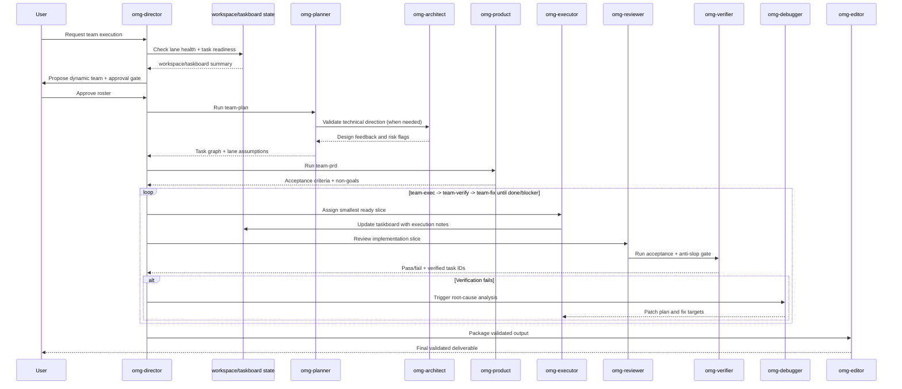

# oh-my-gemini-cli (OmG)

[](https://github.com/Joonghyun-Lee-Frieren/oh-my-gemini-cli/releases)
[](https://github.com/Joonghyun-Lee-Frieren/oh-my-gemini-cli/actions/workflows/version-check.yml)
[](../LICENSE)
[](https://github.com/Joonghyun-Lee-Frieren/oh-my-gemini-cli/stargazers)
[](https://geminicli.com/extensions/?name=Joonghyun-Lee-Frierenoh-my-gemini-cli)
[](https://github.com/sponsors/Joonghyun-Lee-Frieren)

[랜딩 페이지](https://joonghyun-lee-frieren.github.io/oh-my-gemini-cli/) | [변경 이력](./history.md)

[한국어](./README_ko.md) | [日本語](./README_ja.md) | [Français](./README_fr.md) | [中文](./README_zh.md) | [Español](./README_es.md)

Gemini CLI를 위한 컨텍스트 엔지니어링 기반 멀티 에이전트 워크플로우 팩입니다.

> "Claude Code의 핵심 경쟁력은 Opus나 Sonnet 엔진이 아닙니다. Claude Code 그 자체에요. 놀랍지만 Gemini도 Claude Code를 붙이면 잘 돌아갑니다."
>
> - 신정규 (Lablup Inc. CEO), 유튜브 채널 인터뷰 중

이 프로젝트는 이 관찰에서 시작했습니다:
"그 하네스 모델을 Gemini CLI로 가져오면 어떨까?"

OmG는 Gemini CLI를 단일 세션 도우미에서 구조화된 역할 기반 엔지니어링 워크플로우로 확장합니다.


<p align="center">
  
</p>

## Quick Start

### Installation

공식 Gemini Extensions 명령으로 GitHub에서 설치합니다:

```bash
gemini extensions install https://github.com/Joonghyun-Lee-Frieren/oh-my-gemini-cli
```

대화형 모드 확인:

```text
/extensions list
```

터미널 모드 확인:

```bash
gemini extensions list
```

스모크 테스트:

```text
/omg:status
```

참고: 설치/업데이트 명령은 대화형 슬래시 명령 모드가 아니라 터미널 모드(`gemini extensions ...`)에서 실행합니다.

## v0.6.0의 새로운 내용

- 최근 2주(2026-03-20~2026-04-03) Gemini CLI 업스트림 변경과 OmG 호환 가이드를 동기화했습니다.
  - stable `v0.35.0` (2026-03-24)
  - stable `v0.36.0` (2026-04-01)
  - preview `v0.37.0-preview.1` (2026-04-02, 선택 채널)
- 최신 안정 채널 변화에 맞춰 운영 가이드를 강화했습니다.
  - native Git worktree 기반 병렬 세션 가정 반영
  - macOS/Windows/Linux 네이티브 샌드박스 강화 흐름 반영
  - 최근 sub-agent 레지스트리/컨텍스트 동작 변화 반영
- `/omg:doctor` 진단 규칙을 보강해 런타임 호환성 드리프트를 명시적으로 탐지하도록 개선했습니다.
  - worktree 병렬 실행 안전성 저하
  - sandbox 거부 루프에서 회복 품질 저하
  - 구버전 런타임의 plan/subagent 가정 불일치
- 패키지/확장 버전을 `0.6.0`으로 올리고 README/한국어 README/랜딩/히스토리를 갱신했습니다.
## 한눈에 보기

| 항목 | 요약 |
| --- | --- |
| 제공 방식 | 공식 Gemini CLI 확장 (`gemini-extension.json`) |
| 핵심 구성 요소 | `GEMINI.md`, `agents/`, `commands/`, `skills/`, `context/` |
| 주요 사용 사례 | 계획 -> 실행 -> 검증 루프가 필요한 복잡한 구현 작업 |
| 제어 인터페이스 | slash-command-first `/omg:*` 제어면 + 8개 deep-work `$skills`(`omg-plan` 별칭 포함) + 서브 에이전트 위임 |
| 기본 모델 전략 | 계획/아키텍처는 `gemini-3.1-pro-preview`, 실행 중심 작업은 `gemini-3-flash-preview`, 작고 저위험한 수정은 `gemini-3.1-flash-lite-preview` |

## 왜 OmG인가

| 단일 세션 흐름의 문제 | OmG의 대응 |
| --- | --- |
| 계획과 실행 컨텍스트가 섞임 | 역할 분리 에이전트로 책임 분리 |
| 장기 작업에서 진행 가시성 부족 | 명시적 워크플로우 스테이지 + 상태 명령 |
| 병렬 lane/worktree가 서로 충돌하거나 드리프트 | `workspace` + `taskboard`로 lane 소유권, task ID, 검증 상태를 컴팩트하게 유지 |
| 권한 거부된 도구 호출이 반복 재시도로 루프됨 | 거부 이벤트를 approval/fallback 기반 blocker로 승격해 재시도 루프를 차단 |
| deep-interview 진행 중 자동 안내가 인터뷰를 끊음 | learn-signal 훅이 deep-interview 잠금 활성 시 안내를 억제하고 잠금 해제 후에만 재개 |
| 반복적인 프롬프트 엔지니어링 필요 | 운영 제어는 slash command로, 깊은 작업은 유지된 스킬(`$plan`, `$omg-plan`, `$execute`, `$research`)로 분리 |
| 결정 사항과 변경 사항의 드리프트 | 동일 오케스트레이션 루프 내 리뷰/디버깅 역할 포함 |

## 아키텍처

```mermaid
flowchart TD
    U["User Task"] --> CLI["Gemini CLI Session"]
    CLI --> ORCH["OmG Extension Orchestration"]

    CORE["GEMINI.md -> context/omg-core.md"] --> ORCH
    CMDS["commands/omg/*.toml"] --> ORCH
    AGENTS["agents/*.md (role prompts)"] --> ORCH
    SKILLS["skills/*/SKILL.md (retained deep-work skills)"] --> ORCH

    ORCH --> I["/omg:intent"]
    I --> W["/omg:workspace (+ audit when needed)"]
    W --> A["/omg:team-assemble (optional approval gate)"]
    A --> P["team-plan -> team-prd -> taskboard sync"]
    P --> E["team-exec"]
    E --> V["team-verify"]
    V --> D{"Done criteria met?"}
    D -- "No" --> F["team-fix"]
    F --> E
    D -- "Yes" --> O["Validated output + next actions"]

    W -. lane map .-> WS[".omg/state/workspace.json"]
    P -. seed/sync .-> TB[".omg/state/taskboard.md"]
    E -. slice updates .-> TB
    V -. verifier evidence .-> TB
    ORCH -. status/checkpoint/hooks/notify .-> ST[".omg/state/{workflow.md,hooks.json,notify.json,...}"]
```



## 팀 워크플로우



## 알림 라우팅

장기 실행 세션에서 승인 요청, 검증 실패, 블로커, 유휴 상태를 놓치고 싶지 않을 때 `notify`를 사용합니다.

- 프로파일:
  - `quiet`: 긴급 이벤트만 알림
  - `balanced`: 체크포인트와 팀 승인 이벤트까지 포함
  - `watchdog`: `balanced` + 유휴 감시 알림
- 채널:
  - `desktop`
  - `terminal-bell`
  - `file`
  - `webhook`
- 안전 경계:
  - OmG는 이벤트 정책과 템플릿만 관리합니다.
  - 실제 전송은 Gemini 호스트 훅, 셸 스크립트, 외부 웹훅 브리지에 맡깁니다.
  - 위임된 worker 세션에서는 외부 알림 전송을 기본 비활성화합니다.

예시:

```text
/omg:notify profile watchdog
-> approval-needed, verify-failed, blocker-raised, checkpoint-saved, idle-watchdog, session-stop 활성화
-> 기본 채널은 terminal-bell + file 제안
-> .omg/state/notify.json에 정책 저장
```

## Workspace / Taskboard 제어

여러 경로를 오가거나 병렬 구현 lane이 필요한 작업, 그리고 길어진 verify/fix 루프에는 `workspace`와 `taskboard`를 함께 사용하는 편이 안전합니다.

- `/omg:workspace`는 기본 루트와 선택적 worktree/path lane을 `.omg/state/workspace.json`에 기록합니다.
- `/omg:workspace audit`는 병렬 실행, 리뷰, 자동화 전에 lane의 cleanliness, trust, handoff readiness를 점검합니다.
- `/omg:taskboard`는 안정적인 task ID, 담당자, 의존성, 상태(`todo`, `ready`, `in-progress`, `blocked`, `done`, `verified`), lane health 메모, 검증 근거 포인터를 `.omg/state/taskboard.md`에 유지합니다.
- `team-plan`이 task ID와 lane 가정을 시드하고, `team-exec`이 lane/sub-agent 컨텍스트를 포함한 가장 작은 ready 슬라이스를 가져가며, `team-verify`가 근거와 안전한 lane 상태가 있을 때만 `verified`로 올립니다.
- `checkpoint`와 `status`는 긴 대화를 재생하지 않고 이 상태 파일들을 참조하므로 토큰 낭비와 캐시 흔들림을 줄일 수 있습니다.
- `/omg:recall "<질의>"`는 상태 파일 우선 회고 후 부족할 때만 최근 기록을 제한적으로 확장 검색해, 전체 transcript 재생 없이 의사결정 근거를 빠르게 복원합니다.

예시:

```text
/omg:workspace set .
/omg:workspace audit
/omg:workspace add ../feature-auth omg-executor
/omg:taskboard sync
/omg:taskboard next
/omg:recall "auth lane가 막힌 이유" scope=state
```

## Workspace 위생과 Hook 대칭성

장기 세션에서 lane 소유권, 위임 실행, 훅 continuation 흐름이 흐려질 때 이 제어면을 함께 쓰는 편이 안전합니다.

- `/omg:workspace audit`는 dirty 공유 worktree, 신뢰되지 않은 review 경로, handoff-ready/handoff-blocked lane을 드러냅니다.
- `/omg:hooks`와 `/omg:hooks-validate`는 에이전트 라이프사이클 결과(`completed`, `blocked`, `stopped`)를 짝지어 다루며, blocked continuation이 downstream 훅보다 먼저 safety lane을 다시 지나가도록 강제합니다.
- `team-exec`, `team`, `team-verify`, `stop`, `cancel`은 위임된 lane/sub-agent 컨텍스트를 compact하게 유지하고, 실행이 조기 종료되거나 blocker에 걸렸을 때만 상세 내역을 확장합니다.

## 자동 사용량 모니터 (AfterAgent Hook)

OmG에는 에이전트 턴이 끝날 때마다 compact 토큰 사용량 라인을 출력하는 확장 훅이 기본 포함됩니다.

- 훅 엔트리포인트: `hooks/hooks.json` (`AfterAgent` -> `omg-quota-watch-after-agent`)
- 스크립트: `hooks/scripts/after-agent-usage.js`
- 상태 파일: `.omg/state/quota-watch.json` (턴 카운터, 최신 사용량 스냅샷, 마지막으로 처리한 transcript fingerprint)
- 상태 루트 경로 오버라이드: `OMG_STATE_ROOT=<dir>` (절대 경로 또는 세션 `cwd` 기준 상대 경로)
- 훅 출력 조용 모드: `OMG_HOOKS_QUIET=1`

자동 표시 항목:

- 최근 턴 토큰 합계(input/output/cached/total)
- 세션 누적 토큰
- 현재 활성 모델 기준 누적 토큰

경계:

- 이 훅만으로는 계정의 authoritative 남은 quota를 직접 조회할 수 없습니다.
- 실제 남은 quota/limit은 `/stats model`로 확인해야 합니다.
- Gemini가 같은 transcript 스냅샷을 다시 보낼 경우, 훅은 이미 전달된 것으로 처리하고 중복 출력을 생략합니다.

예시 (상태 저장은 유지하고 훅 출력만 숨기기):

```bash
export OMG_HOOKS_QUIET=1
```

예시 (기본 `.omg/state` 대신 다른 경로에 모니터 상태 저장):

```bash
export OMG_STATE_ROOT=.omg/state-local
```

이 훅만 비활성화:

```json
{
  "hooksConfig": {
    "disabled": ["omg-quota-watch-after-agent"]
  }
}
```

## Learn-Signal 안전 필터 (AfterAgent Hook)

OmG는 실행 의도가 확인된 세션에서만 `/omg:learn` 안내를 띄우도록 안전 강화된 learn-signal 훅도 함께 제공합니다.

- 훅 엔트리포인트: `hooks/hooks.json` (`AfterAgent` -> `omg-learn-signal-after-agent`)
- 스크립트: `hooks/scripts/learn.js`
- 상태 파일: `.omg/state/learn-watch.json` (중복 억제 이벤트 키, 세션당 1회 안내 추적, 정리된 상태)
- deep-interview 잠금 상태 참조(읽기 전용): `.omg/state/deep-interview.json`
- 런타임 제어:
  - `OMG_STATE_ROOT=<dir>`로 `learn-watch.json` 저장 위치 변경
  - `OMG_HOOKS_QUIET=1`로 안내 출력만 숨기고 상태 저장은 유지

안전 동작:

- deep-interview 잠금 상태가 활성인 동안에는 learn 안내를 억제해 인터뷰 흐름을 보호합니다.
- 정보성 질의만 있는 세션은 안내를 생략합니다.
- 같은 transcript 스냅샷에 대한 반복 재시도는 중복 출력하지 않습니다.
- 기존 상태가 손상되었거나 스키마가 오래된 경우 정리 후 재사용합니다.

이 훅만 비활성화:

```json
{
  "hooksConfig": {
    "disabled": ["omg-learn-signal-after-agent"]
  }
}
```

## Gemini CLI 호환성 노트 (검토일: 2026-04-03)

- 권장 stable 런타임: Gemini CLI `v0.36.0+`
  - OmG가 현재 전제로 두는 native worktree 세션, 강화된 샌드박스 기본 정책, 최신 sub-agent 오케스트레이션 개선이 포함됩니다.
- 최근 stable 업데이트 중 OmG 영향 항목:
  - `v0.35.0` (2026-03-24): 키보드/비임 조작성 확장, `SandboxManager` + Linux bubblewrap/seccomp 격리 강화, JIT context discovery 개선
  - `v0.36.0` (2026-04-01): multi-registry sub-agent 구조, macOS Seatbelt/Windows 네이티브 샌드박스, Git worktree 지원, sub-agent 컨텍스트/거부 복원 강화
- preview 채널 참고:
  - `v0.37.0-preview.1` (2026-04-02)은 plan-mode/untrusted-folder 및 동적 샌드박스 확장 실험을 포함하지만, OmG는 preview 기능을 필수로 요구하지 않습니다.
- `v0.34.0-preview.0+`에서 추가된 UX도 계속 유효합니다:
  - `/skill-name` 기반 스킬 직접 호출
  - `/footer` 기반 footer 구성(내부적으로 `ui.footer.items`, `ui.footer.showLabels`, `ui.footer.hideCWD`, `ui.footer.hideSandboxStatus`, `ui.footer.hideModelInfo`)
- OmG의 slash-skill 호환 경로:
  - 기본 `/plan`과 충돌 없이 OmG 플랜 스킬을 부르려면 `/omg-plan`(또는 `$omg-plan`)을 사용합니다.
- 정책 엔진 마이그레이션:
  - 래퍼 스크립트가 아직 `--allowed-tools`를 사용한다면 `--policy` 프로파일로 옮기는 편이 안전합니다.
- 네이티브 `/plan` 모드와 OmG planning 명령은 함께 사용할 수 있습니다.
  - native: `/plan`
  - OmG staged flow: `/omg:team-plan`, `/omg:team-prd`
## 인터페이스 맵

### Commands

| 명령 | 목적 | 사용 시점 |
| --- | --- | --- |
| `/omg:status` | 진행 상황, 리스크, 다음 액션 요약 | 세션 시작/종료 |
| `/omg:doctor` | 확장/팀/workspace/훅 준비도 진단과 복구 액션 제시 | 장기 자율 실행 전 또는 환경 이상 징후 발생 시 |
| `/omg:hud` | 시각 HUD 프로파일 조회/전환 (`normal`, `compact`, `hidden`) | 장기 세션 시작 전 또는 터미널 밀도 변경 시 |
| `/omg:hud-on` | HUD를 전체 시각 모드로 빠르게 전환 | 전체 상태 보드로 복귀할 때 |
| `/omg:hud-compact` | HUD를 컴팩트 모드로 빠르게 전환 | 구현 루프 중 밀도 높은 업데이트가 필요할 때 |
| `/omg:hud-off` | HUD를 숨김 모드로 빠르게 전환 (플레인 상태 섹션) | 시각 블록이 방해될 때 |
| `/omg:notify` | 승인/블로커/검증 결과/체크포인트/유휴 감시 알림 라우팅 구성 | 무인 `autopilot`/`loop` 실행 전 또는 알림 노이즈 조정 시 |
| `/omg:intent` | 요청 인텐트를 분류하고 적절한 스테이지/명령으로 라우팅 | 계획/구현 전, 요청 의도가 모호할 때 |
| `/omg:rules` | 작업 조건에 맞는 가드레일 룰 팩 활성화 | 마이그레이션/보안/성능 민감 작업 시작 전 |
| `/omg:deep-init` | 장기 세션을 위한 프로젝트 맵/검증 기준선 초기화 | 신규 코드베이스 온보딩 또는 대형 작업 킥오프 시 |
| `/omg:workspace` | 기본 루트, worktree/path lane, 충돌 경계를 설정/조회하고 audit 수행 | 병렬 구현 또는 멀티 루트 작업 전 |
| `/omg:taskboard` | 안정적인 task ID와 verifier 기반 완료 상태를 유지하는 컴팩트 작업 보드 | 계획 후 및 장기 exec/verify 루프 전반 |
| `/omg:recall` | 상태 파일 우선 + 제한적 이력 확장 검색으로 과거 결정/근거 복원 | 긴 세션에서 과거 맥락을 전체 transcript 재생 없이 빠르게 찾을 때 |
| `/omg:team` | 전체 스테이지 파이프라인 실행 (`plan -> prd -> taskboard -> exec -> verify -> fix`) | 복잡한 기능/리팩터링 전달 |
| `/omg:team-plan` | 의존성을 반영한 실행 계획 수립 | 구현 전 |
| `/omg:team-prd` | 측정 가능한 수용 기준과 제약 고정 | 계획 후, 코딩 전 |
| `/omg:team-exec` | 범위가 고정된 구현 슬라이스를 lane/sub-agent 핸드오프와 함께 수행 | 메인 구현 루프 |
| `/omg:team-verify` | 수용 기준과 회귀 검증 | 각 실행 슬라이스 이후 |
| `/omg:team-fix` | 검증으로 확인된 실패만 패치 | 검증 실패 시 |
| `/omg:loop` | `exec -> verify -> fix` 반복을 done/blocker까지 강제 | 미해결 이슈가 남은 중/후반 구현 단계 |
| `/omg:mode` | 운영 프로파일 조회/전환 (`balanced/speed/deep/autopilot/ralph/ultrawork`) | 세션 시작 또는 운영 방식 전환 시 |
| `/omg:approval` | 승인 포스처 조회/전환 (`suggest/auto/full-auto`) | 자율 실행 루프 시작 전 또는 승인 정책 변경 시 |
| `/omg:autopilot` | 체크포인트 기반 반복 자동 사이클 실행 | 자율 실행이 필요한 복잡 작업 |
| `/omg:ralph` | 엄격한 품질 게이트 오케스트레이션 강제 | 릴리스 크리티컬 작업 |
| `/omg:ultrawork` | 독립 작업 배치 처리 중심 고처리량 모드 | 대규모 백로그 |
| `/omg:consensus` | 복수 설계 옵션을 하나로 수렴 | 의사결정 중심 구간 |
| `/omg:launch` | 장기 작업을 위한 영속 라이프사이클 상태 초기화 | 장기 세션 시작 시 |
| `/omg:checkpoint` | taskboard/workspace 참조가 포함된 컴팩트 체크포인트 저장 | 세션 중간 핸드오프 |
| `/omg:stop` | 자율 모드를 안전 중지하고 진행 상태 보존 | 일시 중지/인터럽트 시 |
| `/omg:cancel` | 하네스 스타일 취소 별칭(안전 중지 + 재개 핸드오프) | 자율/팀 플로우를 즉시 중단해야 할 때 |
| `/omg:optimize` | 품질/토큰 효율을 위한 프롬프트/컨텍스트 개선 | 세션이 복잡하거나 비용이 커진 뒤 |
| `/omg:cache` | 캐시/컨텍스트 동작과 compact 상태 앵커 사용 여부 점검 | 장기 컨텍스트 작업 |

### Skills

유지되는 스킬은 discovery 메타데이터를 줄이기 위해 compact deep-work 세트로 유지하며, `/plan` 충돌 회피를 위한 호환 별칭 `$omg-plan`만 추가로 제공합니다.

| 스킬 | 초점 | 출력 스타일 |
| --- | --- | --- |
| `$plan` | 목표를 단계별 계획으로 변환 | 마일스톤, 리스크, 수용 기준 |
| `$omg-plan` | 기본 `/plan`과 충돌을 피하는 slash 친화 플랜 별칭 | `$plan`과 동일한 계획 산출물 |
| `$ralplan` | 롤백 지점을 포함한 엄격한 스테이지 게이팅 계획 | 품질 우선 실행 맵 |
| `$execute` | 범위가 고정된 계획 슬라이스 구현 | 변경 요약 + 검증 노트 |
| `$prd` | 요청을 측정 가능한 수용 기준으로 변환 | PRD 스타일 범위 계약 |
| `$research` | 옵션/트레이드오프 탐색 | 의사결정 중심 비교 |
| `$deep-dive` | 실행 전 trace-to-interview 기반 요구사항 정제 | 명확도 점수 + 가정 원장 + launch brief |
| `$context-optimize` | 컨텍스트 구조 개선 | 압축 + 신호 대 잡음 최적화 |

### Sub-agents

| 에이전트 | 주 책임 | 권장 모델 프로파일 |
| --- | --- | --- |
| `omg-architect` | 시스템 경계, 인터페이스, 장기 유지보수성 | `gemini-3.1-pro-preview` |
| `omg-planner` | 작업 분해와 순서/의존성 관리 | `gemini-3.1-pro-preview` |
| `omg-product` | 범위/비범위와 측정 가능한 수용 기준 고정 | `gemini-3.1-pro-preview` |
| `omg-executor` | 빠른 구현 사이클 | `gemini-3-flash-preview` |
| `omg-reviewer` | 정확성/회귀 리스크 점검 | `gemini-3.1-pro-preview` |
| `omg-verifier` | 수용 기준 근거 검증과 릴리스 준비도 판단 | `gemini-3.1-pro-preview` |
| `omg-debugger` | 근본 원인 분석과 패치 전략 | `gemini-3.1-pro-preview` |
| `omg-consensus` | 옵션 스코어링과 의사결정 수렴 | `gemini-3.1-pro-preview` |
| `omg-researcher` | 외부 옵션 분석과 종합 | `gemini-3.1-pro-preview` |
| `omg-quick` | 의도된 적은 수정 | `gemini-3.1-flash-lite-preview` |

## 컨텍스트 레이어 모델

| 레이어 | 소스 | 목표 |
| --- | --- | --- |
| 1 | 시스템 / 런타임 제약 | 플랫폼 보장사항과 동작 정렬 |
| 2 | 프로젝트 표준 | 팀 컨벤션과 아키텍처 의도 유지 |
| 3 | 얇은 `GEMINI.md` 및 공유 컨텍스트 | 무거운 절차를 매 턴 싣지 않고 장기 세션 메모리 안정성 유지 |
| 4 | 현재 작업 브리프 + workspace/taskboard 상태 | 현재 목표, active lane, 수용 기준 가시화 |
| 5 | 최신 실행 트레이스 | 전체 원문 이력을 다시 싣지 않고 반복/검증 루프 지원 |

## 프로젝트 구조

```text
oh-my-gemini-cli/
|- GEMINI.md
|- gemini-extension.json
|- agents/
|- commands/
|  `- omg/
|- skills/
|- context/
|- docs/
`- LICENSE
```

## 문제 해결

| 증상 | 가능 원인 | 조치 |
| --- | --- | --- |
| 설치 중 `settings.filter is not a function` | Gemini CLI 런타임 또는 확장 메타데이터 캐시가 오래됨 | Gemini CLI 업데이트 후 확장 제거/재설치 |
| `/omg:*` 명령을 찾을 수 없음 | 현재 세션에 확장이 로드되지 않음 | `gemini extensions list` 실행 후 CLI 세션 재시작 |
| `/plan`이 열리고 OmG 플랜 스킬이 실행되지 않음 | 기본 `/plan`과 스킬 슬래시 호출 이름이 충돌함 | OmG 플랜 스킬은 `/omg-plan`(또는 `$omg-plan`)으로 호출하거나, 단계형 흐름은 `/omg:team-plan` 사용 |
| 스킬이 트리거되지 않음 | 유지된 deep-work 스킬만 남아 있거나 확장 메타데이터가 오래됨 | README의 유지 스킬 목록 확인 후 확장/세션 재로드 |
| 병렬 구현이 자꾸 같은 파일에서 충돌하거나 재계획됨 | workspace lane이 명시되지 않음 | `/omg:workspace status`로 확인하거나 `/omg:workspace`로 경로/lane 소유권 설정 |
| dirty하거나 신뢰되지 않은 lane 위에서 바로 리뷰/자동화를 돌리려 함 | 공유 worktree 위생 상태가 불명확함 | `/omg:workspace audit`로 점검하고, 필요 시 lane을 분리한 뒤 verify/review를 이어서 실행 |
| 길어진 루프에서 done 판정이 흔들림 | 컴팩트한 작업 기준 상태 또는 verifier signoff 부족 | `/omg:taskboard sync` 후 `/omg:team-verify`를 다시 실행해 남은 task ID 정리 |
| 이전 결정 이유가 기억나지 않음 | 근거가 긴 세션 이력에 묻힘 | `/omg:recall "<키워드>" scope=state`로 먼저 찾고, 필요 시에만 `scope=recent`로 확장 |
| continuation 이후 훅이 두 번 실행되거나 종료 이벤트를 놓침 | hook lifecycle 대칭성이 불명확함 | `/omg:hooks-validate`를 실행해 lifecycle policy를 정리한 뒤 자율 루프를 다시 켬 |
| 자율 실행에서 확인 요청이 너무 많거나 너무 적음 | 승인 포스처가 작업 위험도와 불일치 | `/omg:approval suggest|auto|full-auto`로 재설정 후 재확인 |
| 장기 실행 전에 환경 정상 여부가 불확실함 | 상태/구성 드리프트 누적 | `/omg:doctor`(또는 `/omg:doctor team`) 실행 후 복구 항목 반영 |

## 마이그레이션 노트

| 기존 흐름 | Extensions-First 흐름 |
| --- | --- |
| 전역 패키지 설치 + `omg setup` 복사 프로세스 | `gemini extensions install ...` |
| CLI 스크립트 중심 런타임 연결 | 확장 매니페스트 중심 런타임 연결 |
| 수동 온보딩 스크립트 | Gemini CLI의 네이티브 확장 로딩 |


## 영감을 받은 프로젝트

- [Gemini CLI](https://github.com/google-gemini/gemini-cli) - Google의 오픈소스 AI 터미널 에이전트
- [oh-my-codex](https://github.com/Yeachan-Heo/oh-my-codex) - OpenAI Codex CLI 하네스
- [oh-my-claudecode](https://github.com/Yeachan-Heo/oh-my-claudecode) - Claude Code CLI 하네스
- [oh-my-opencode](https://github.com/code-yeongyu/oh-my-opencode) - OpenCode 에이전트 하네스
- [Claude Code 프롬프트 캐싱 교훈](https://news.hada.io/topic?id=26835) - 컨텍스트 엔지니어링 원리
- [everything-claude-code](https://github.com/affaan-m/everything-claude-code) - Claude Code CLI 하네스

## 문서

- [설치 가이드](./guide/installation.md)
- [컨텍스트 엔지니어링 가이드](./guide/context-engineering.md)
- [한국어 컨텍스트 엔지니어링 가이드](./guide/context-engineering_ko.md)
- [변경 이력](./history.md)

## Star History

[](https://www.star-history.com/?repos=Joonghyun-Lee-Frieren%2Foh-my-gemini-cli&type=date&legend=top-left)

## 라이선스

MIT

