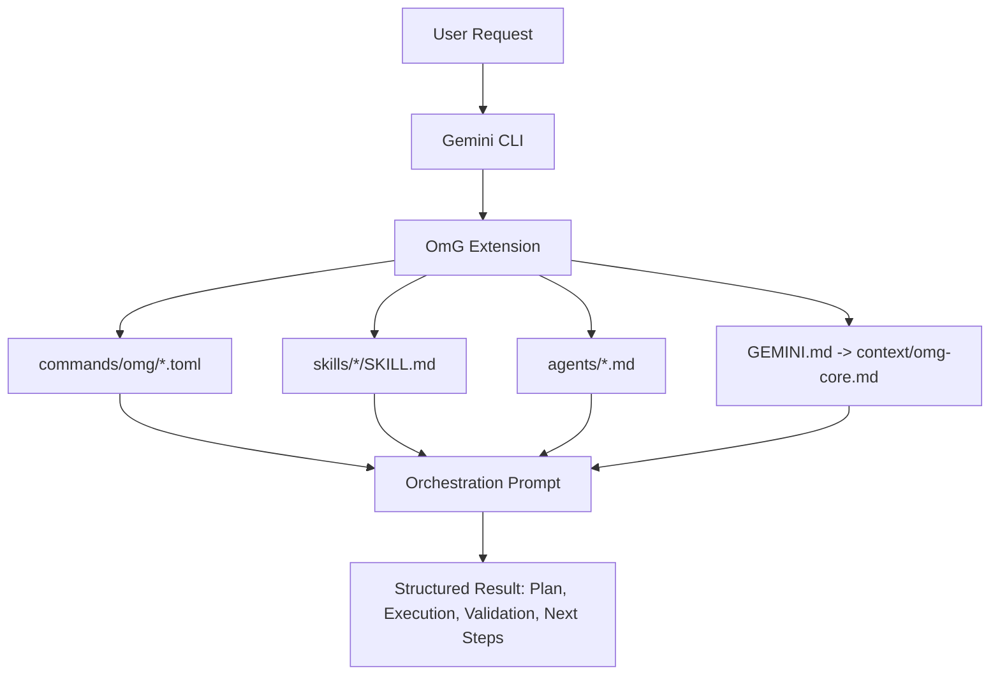
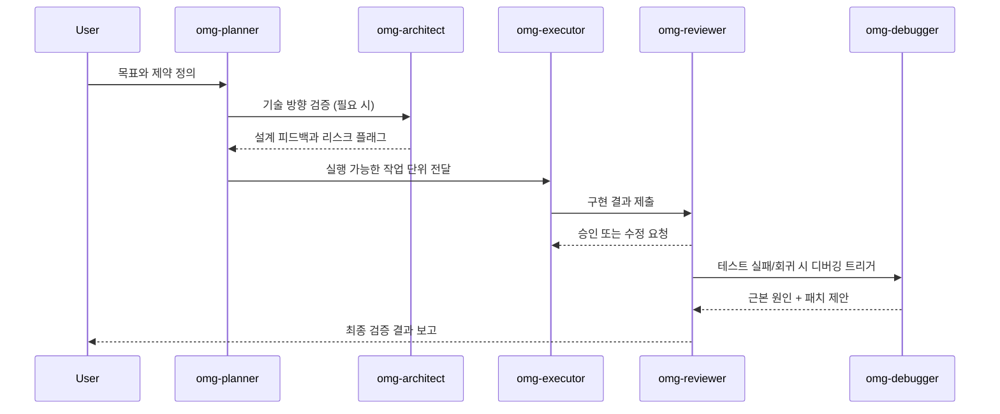

# oh-my-gemini-cli (OmG)

[랜딩 페이지](https://joonghyun-lee-frieren.github.io/oh-my-gemini-cli/) | [변경 이력](./history.md)

[한국어](./README_ko.md) | [日本語](./README_ja.md) | [Français](./README_fr.md) | [中文](./README_zh.md) | [Español](./README_es.md)

Gemini CLI를 위한 컨텍스트 엔지니어링 기반 멀티 에이전트 워크플로우 팩입니다.

> "Claude Code의 핵심 경쟁력은 Opus나 Sonnet 엔진이 아닙니다. Claude Code 그 자체에요. 놀랍지만 Gemini도 Claude Code를 붙이면 잘 돌아갑니다."
>
> - 신정규 (Lablup Inc. CEO), 유튜브 채널 인터뷰 중

이 프로젝트는 이 관찰에서 시작했습니다:
"그 하네스 모델을 Gemini CLI로 가져오면 어떨까?"

OmG는 Gemini CLI를 단일 세션 도우미에서 구조화된 역할 기반 엔지니어링 워크플로우로 확장합니다.

## v0.3.9의 새로운 내용

- 런타임 코드를 늘리지 않고 lane 위생 점검 추가:
  - `/omg:workspace audit`가 lane별 dirty/clean 상태, 신뢰 여부, 핸드오프 준비 상태를 점검
  - `taskboard`, `doctor`, `launch`, `status`가 unsafe lane 상태를 1급 blocker 신호로 취급
- 훅 라이프사이클 대칭성 강화:
  - `hooks`, `hooks-init`, `hooks-validate`, `hooks-test`가 blocked/조기 종료 에이전트 결과를 명시적으로 다룸
  - blocked continuation은 quality/optimization 훅보다 먼저 safety lane을 다시 거치도록 정렬
- 위임 실행 핸드오프를 더 조용하고 명확하게 정리:
  - `team-assemble`, `team-exec`, `team`, `team-verify`, `stop`, `cancel`이 lane/sub-agent 컨텍스트를 명시적으로 유지
  - 정상 성공 경로는 짧게, blocked/조기 종료 분기만 자세히 확장
- 경량성과 캐시 안정성 유지:
  - 새 데몬, 백그라운드 워커, 무거운 항상-로드 컨텍스트는 추가하지 않음
  - 상태는 계속 compact(`workspace.json`, `taskboard.md`, `hooks.json`)하게 유지하고 volatile churn을 피함

## 한눈에 보기

| 항목 | 요약 |
| --- | --- |
| 제공 방식 | 공식 Gemini CLI 확장 (`gemini-extension.json`) |
| 핵심 구성 요소 | `GEMINI.md`, `agents/`, `commands/`, `skills/`, `context/` |
| 주요 사용 사례 | 계획 -> 실행 -> 검증 루프가 필요한 복잡한 구현 작업 |
| 제어 인터페이스 | slash-command-first `/omg:*` 제어면 + 6개 deep-work `$skill` + 서브 에이전트 위임 |
| 기본 모델 전략 | 계획/아키텍처는 `gemini-3.1-pro`, 실행 중심 작업은 `gemini-3.1-flash`, 작고 저위험한 수정은 `gemini-3.1-flash-lite` |

## 왜 OmG인가

| 단일 세션 흐름의 문제 | OmG의 대응 |
| --- | --- |
| 계획과 실행 컨텍스트가 섞임 | 역할 분리 에이전트로 책임 분리 |
| 장기 작업에서 진행 가시성 부족 | 명시적 워크플로우 스테이지 + 상태 명령 |
| 병렬 lane/worktree가 서로 충돌하거나 드리프트 | `workspace` + `taskboard`로 lane 소유권, task ID, 검증 상태를 컴팩트하게 유지 |
| 반복적인 프롬프트 엔지니어링 필요 | 운영 제어는 slash command로, 깊은 작업은 유지된 스킬(`$plan`, `$execute`, `$research`)로 분리 |
| 결정 사항과 변경 사항의 드리프트 | 동일 오케스트레이션 루프 내 리뷰/디버깅 역할 포함 |

## 아키텍처



## 팀 워크플로우



## 알림 라우팅

장기 실행 세션에서 승인 요청, 검증 실패, 블로커, 유휴 상태를 놓치고 싶지 않을 때 `notify`를 사용합니다.

- 프로파일:
  - `quiet`: 긴급 이벤트만 알림
  - `balanced`: 체크포인트와 팀 승인 이벤트까지 포함
  - `watchdog`: `balanced` + 유휴 감시 알림
- 채널:
  - `desktop`
  - `terminal-bell`
  - `file`
  - `webhook`
- 안전 경계:
  - OmG는 이벤트 정책과 템플릿만 관리합니다.
  - 실제 전송은 Gemini 호스트 훅, 셸 스크립트, 외부 웹훅 브리지에 맡깁니다.
  - 위임된 worker 세션에서는 외부 알림 전송을 기본 비활성화합니다.

예시:

```text
/omg:notify profile watchdog
-> approval-needed, verify-failed, blocker-raised, checkpoint-saved, idle-watchdog, session-stop 활성화
-> 기본 채널은 terminal-bell + file 제안
-> .omg/state/notify.json에 정책 저장
```

## Workspace / Taskboard 제어

여러 경로를 오가거나 병렬 구현 lane이 필요한 작업, 그리고 길어진 verify/fix 루프에는 `workspace`와 `taskboard`를 함께 사용하는 편이 안전합니다.

- `/omg:workspace`는 기본 루트와 선택적 worktree/path lane을 `.omg/state/workspace.json`에 기록합니다.
- `/omg:workspace audit`는 병렬 실행, 리뷰, 자동화 전에 lane의 cleanliness, trust, handoff readiness를 점검합니다.
- `/omg:taskboard`는 안정적인 task ID, 담당자, 의존성, 상태(`todo`, `ready`, `in-progress`, `blocked`, `done`, `verified`), lane health 메모, 검증 근거 포인터를 `.omg/state/taskboard.md`에 유지합니다.
- `team-plan`이 task ID와 lane 가정을 시드하고, `team-exec`이 lane/sub-agent 컨텍스트를 포함한 가장 작은 ready 슬라이스를 가져가며, `team-verify`가 근거와 안전한 lane 상태가 있을 때만 `verified`로 올립니다.
- `checkpoint`와 `status`는 긴 대화를 재생하지 않고 이 상태 파일들을 참조하므로 토큰 낭비와 캐시 흔들림을 줄일 수 있습니다.

예시:

```text
/omg:workspace set .
/omg:workspace audit
/omg:workspace add ../feature-auth omg-executor
/omg:taskboard sync
/omg:taskboard next
```

## Workspace 위생과 Hook 대칭성

장기 세션에서 lane 소유권, 위임 실행, 훅 continuation 흐름이 흐려질 때 이 제어면을 함께 쓰는 편이 안전합니다.

- `/omg:workspace audit`는 dirty 공유 worktree, 신뢰되지 않은 review 경로, handoff-ready/handoff-blocked lane을 드러냅니다.
- `/omg:hooks`와 `/omg:hooks-validate`는 에이전트 라이프사이클 결과(`completed`, `blocked`, `stopped`)를 짝지어 다루며, blocked continuation이 downstream 훅보다 먼저 safety lane을 다시 지나가도록 강제합니다.
- `team-exec`, `team`, `team-verify`, `stop`, `cancel`은 위임된 lane/sub-agent 컨텍스트를 compact하게 유지하고, 실행이 조기 종료되거나 blocker에 걸렸을 때만 상세 내역을 확장합니다.

## 설치

공식 Gemini Extensions 명령으로 GitHub에서 설치합니다:

```bash
gemini extensions install https://github.com/Joonghyun-Lee-Frieren/oh-my-gemini-cli
```

대화형 모드 확인:

```text
/extensions list
```

터미널 모드 확인:

```bash
gemini extensions list
```

스모크 테스트:

```text
/omg:status
```

참고: 설치/업데이트 명령은 대화형 슬래시 명령 모드가 아니라 터미널 모드(`gemini extensions ...`)에서 실행합니다.

## Gemini CLI 호환성 노트 (검토일: 2026-03-12)

- 권장 런타임: Gemini CLI `v0.33.0+`
  - 최근 upstream의 hook lifecycle 안정화, sub-agent policy context 전달, dirty worktree 처리, slash 기반 skill 사용성 개선을 반영하기 좋습니다.
- 정책 엔진 마이그레이션:
  - 래퍼 스크립트가 아직 `--allowed-tools`를 사용한다면 `--policy` 프로파일로 옮기는 편이 안전합니다.
- 네이티브 `/plan` 모드와 OmG planning 명령은 함께 사용할 수 있습니다.
  - native: `/plan`
  - OmG staged flow: `/omg:team-plan`, `/omg:team-prd`
- preview 채널 전용 기능(예: experimental model steering 문서나 manifest preview 옵션)은 OmG에 필수는 아니며 기본값으로 켜지지 않습니다.

## 인터페이스 맵

### Commands

| 명령 | 목적 | 사용 시점 |
| --- | --- | --- |
| `/omg:status` | 진행 상황, 리스크, 다음 액션 요약 | 세션 시작/종료 |
| `/omg:doctor` | 확장/팀/workspace/훅 준비도 진단과 복구 액션 제시 | 장기 자율 실행 전 또는 환경 이상 징후 발생 시 |
| `/omg:hud` | 시각 HUD 프로파일 조회/전환 (`normal`, `compact`, `hidden`) | 장기 세션 시작 전 또는 터미널 밀도 변경 시 |
| `/omg:hud-on` | HUD를 전체 시각 모드로 빠르게 전환 | 전체 상태 보드로 복귀할 때 |
| `/omg:hud-compact` | HUD를 컴팩트 모드로 빠르게 전환 | 구현 루프 중 밀도 높은 업데이트가 필요할 때 |
| `/omg:hud-off` | HUD를 숨김 모드로 빠르게 전환 (플레인 상태 섹션) | 시각 블록이 방해될 때 |
| `/omg:notify` | 승인/블로커/검증 결과/체크포인트/유휴 감시 알림 라우팅 구성 | 무인 `autopilot`/`loop` 실행 전 또는 알림 노이즈 조정 시 |
| `/omg:intent` | 요청 인텐트를 분류하고 적절한 스테이지/명령으로 라우팅 | 계획/구현 전, 요청 의도가 모호할 때 |
| `/omg:rules` | 작업 조건에 맞는 가드레일 룰 팩 활성화 | 마이그레이션/보안/성능 민감 작업 시작 전 |
| `/omg:deep-init` | 장기 세션을 위한 프로젝트 맵/검증 기준선 초기화 | 신규 코드베이스 온보딩 또는 대형 작업 킥오프 시 |
| `/omg:workspace` | 기본 루트, worktree/path lane, 충돌 경계를 설정/조회하고 audit 수행 | 병렬 구현 또는 멀티 루트 작업 전 |
| `/omg:taskboard` | 안정적인 task ID와 verifier 기반 완료 상태를 유지하는 컴팩트 작업 보드 | 계획 후 및 장기 exec/verify 루프 전반 |
| `/omg:team` | 전체 스테이지 파이프라인 실행 (`plan -> prd -> taskboard -> exec -> verify -> fix`) | 복잡한 기능/리팩터링 전달 |
| `/omg:team-plan` | 의존성을 반영한 실행 계획 수립 | 구현 전 |
| `/omg:team-prd` | 측정 가능한 수용 기준과 제약 고정 | 계획 후, 코딩 전 |
| `/omg:team-exec` | 범위가 고정된 구현 슬라이스를 lane/sub-agent 핸드오프와 함께 수행 | 메인 구현 루프 |
| `/omg:team-verify` | 수용 기준과 회귀 검증 | 각 실행 슬라이스 이후 |
| `/omg:team-fix` | 검증으로 확인된 실패만 패치 | 검증 실패 시 |
| `/omg:loop` | `exec -> verify -> fix` 반복을 done/blocker까지 강제 | 미해결 이슈가 남은 중/후반 구현 단계 |
| `/omg:mode` | 운영 프로파일 조회/전환 (`balanced/speed/deep/autopilot/ralph/ultrawork`) | 세션 시작 또는 운영 방식 전환 시 |
| `/omg:approval` | 승인 포스처 조회/전환 (`suggest/auto/full-auto`) | 자율 실행 루프 시작 전 또는 승인 정책 변경 시 |
| `/omg:autopilot` | 체크포인트 기반 반복 자동 사이클 실행 | 자율 실행이 필요한 복잡 작업 |
| `/omg:ralph` | 엄격한 품질 게이트 오케스트레이션 강제 | 릴리스 크리티컬 작업 |
| `/omg:ultrawork` | 독립 작업 배치 처리 중심 고처리량 모드 | 대규모 백로그 |
| `/omg:consensus` | 복수 설계 옵션을 하나로 수렴 | 의사결정 중심 구간 |
| `/omg:launch` | 장기 작업을 위한 영속 라이프사이클 상태 초기화 | 장기 세션 시작 시 |
| `/omg:checkpoint` | taskboard/workspace 참조가 포함된 컴팩트 체크포인트 저장 | 세션 중간 핸드오프 |
| `/omg:stop` | 자율 모드를 안전 중지하고 진행 상태 보존 | 일시 중지/인터럽트 시 |
| `/omg:cancel` | 하네스 스타일 취소 별칭(안전 중지 + 재개 핸드오프) | 자율/팀 플로우를 즉시 중단해야 할 때 |
| `/omg:optimize` | 품질/토큰 효율을 위한 프롬프트/컨텍스트 개선 | 세션이 복잡하거나 비용이 커진 뒤 |
| `/omg:cache` | 캐시/컨텍스트 동작과 compact 상태 앵커 사용 여부 점검 | 장기 컨텍스트 작업 |

### Skills

유지되는 스킬은 겹치지 않는 deep-work 워크플로우만 남겨 세션 시작 시 discovery 메타데이터를 줄였습니다.

| 스킬 | 초점 | 출력 스타일 |
| --- | --- | --- |
| `$plan` | 목표를 단계별 계획으로 변환 | 마일스톤, 리스크, 수용 기준 |
| `$ralplan` | 롤백 지점을 포함한 엄격한 스테이지 게이팅 계획 | 품질 우선 실행 맵 |
| `$execute` | 범위가 고정된 계획 슬라이스 구현 | 변경 요약 + 검증 노트 |
| `$prd` | 요청을 측정 가능한 수용 기준으로 변환 | PRD 스타일 범위 계약 |
| `$research` | 옵션/트레이드오프 탐색 | 의사결정 중심 비교 |
| `$context-optimize` | 컨텍스트 구조 개선 | 압축 + 신호 대 잡음 최적화 |

### Sub-agents

| 에이전트 | 주 책임 | 권장 모델 프로파일 |
| --- | --- | --- |
| `omg-architect` | 시스템 경계, 인터페이스, 장기 유지보수성 | `gemini-3.1-pro` |
| `omg-planner` | 작업 분해와 순서/의존성 관리 | `gemini-3.1-pro` |
| `omg-product` | 범위/비범위와 측정 가능한 수용 기준 고정 | `gemini-3.1-pro` |
| `omg-executor` | 빠른 구현 사이클 | `gemini-3.1-flash` |
| `omg-reviewer` | 정확성/회귀 리스크 점검 | `gemini-3.1-pro` |
| `omg-verifier` | 수용 기준 근거 검증과 릴리스 준비도 판단 | `gemini-3.1-pro` |
| `omg-debugger` | 근본 원인 분석과 패치 전략 | `gemini-3.1-pro` |
| `omg-consensus` | 옵션 스코어링과 의사결정 수렴 | `gemini-3.1-pro` |
| `omg-researcher` | 외부 옵션 분석과 종합 | `gemini-3.1-pro` |
| `omg-quick` | 작은 전술적 수정 | `gemini-3.1-flash-lite` |

## 컨텍스트 레이어 모델

| 레이어 | 소스 | 목표 |
| --- | --- | --- |
| 1 | 시스템 / 런타임 제약 | 플랫폼 보장사항과 동작 정렬 |
| 2 | 프로젝트 표준 | 팀 컨벤션과 아키텍처 의도 유지 |
| 3 | 얇은 `GEMINI.md` 및 공유 컨텍스트 | 무거운 절차를 매 턴 싣지 않고 장기 세션 메모리 안정성 유지 |
| 4 | 현재 작업 브리프 + workspace/taskboard 상태 | 현재 목표, active lane, 수용 기준 가시화 |
| 5 | 최신 실행 트레이스 | 전체 원문 이력을 다시 싣지 않고 반복/검증 루프 지원 |

## 프로젝트 구조

```text
oh-my-gemini-cli/
|- GEMINI.md
|- gemini-extension.json
|- agents/
|- commands/
|  `- omg/
|- skills/
|- context/
|- docs/
`- LICENSE
```

## 문제 해결

| 증상 | 가능 원인 | 조치 |
| --- | --- | --- |
| 설치 중 `settings.filter is not a function` | Gemini CLI 런타임 또는 확장 메타데이터 캐시가 오래됨 | Gemini CLI 업데이트 후 확장 제거/재설치 |
| `/omg:*` 명령을 찾을 수 없음 | 현재 세션에 확장이 로드되지 않음 | `gemini extensions list` 실행 후 CLI 세션 재시작 |
| 스킬이 트리거되지 않음 | 유지된 deep-work 스킬만 남아 있거나 확장 메타데이터가 오래됨 | README의 유지 스킬 목록 확인 후 확장/세션 재로드 |
| 병렬 구현이 자꾸 같은 파일에서 충돌하거나 재계획됨 | workspace lane이 명시되지 않음 | `/omg:workspace status`로 확인하거나 `/omg:workspace`로 경로/lane 소유권 설정 |
| dirty하거나 신뢰되지 않은 lane 위에서 바로 리뷰/자동화를 돌리려 함 | 공유 worktree 위생 상태가 불명확함 | `/omg:workspace audit`로 점검하고, 필요 시 lane을 분리한 뒤 verify/review를 이어서 실행 |
| 길어진 루프에서 done 판정이 흔들림 | 컴팩트한 작업 기준 상태 또는 verifier signoff 부족 | `/omg:taskboard sync` 후 `/omg:team-verify`를 다시 실행해 남은 task ID 정리 |
| continuation 이후 훅이 두 번 실행되거나 종료 이벤트를 놓침 | hook lifecycle 대칭성이 불명확함 | `/omg:hooks-validate`를 실행해 lifecycle policy를 정리한 뒤 자율 루프를 다시 켬 |
| 자율 실행에서 확인 요청이 너무 많거나 너무 적음 | 승인 포스처가 작업 위험도와 불일치 | `/omg:approval suggest|auto|full-auto`로 재설정 후 재확인 |
| 장기 실행 전에 환경 정상 여부가 불확실함 | 상태/구성 드리프트 누적 | `/omg:doctor`(또는 `/omg:doctor team`) 실행 후 복구 항목 반영 |

## 마이그레이션 노트

| 기존 흐름 | Extensions-First 흐름 |
| --- | --- |
| 전역 패키지 설치 + `omg setup` 복사 프로세스 | `gemini extensions install ...` |
| CLI 스크립트 중심 런타임 연결 | 확장 매니페스트 중심 런타임 연결 |
| 수동 온보딩 스크립트 | Gemini CLI의 네이티브 확장 로딩 |


## 영감을 받은 프로젝트

- [Gemini CLI](https://github.com/google-gemini/gemini-cli) - Google의 오픈소스 AI 터미널 에이전트
- [oh-my-codex](https://github.com/Yeachan-Heo/oh-my-codex) - OpenAI Codex CLI 하네스
- [oh-my-claudecode](https://github.com/Yeachan-Heo/oh-my-claudecode) - Claude Code CLI 하네스
- [oh-my-opencode](https://github.com/code-yeongyu/oh-my-opencode) - OpenCode 에이전트 하네스
- [Claude Code 프롬프트 캐싱 교훈](https://news.hada.io/topic?id=26835) - 컨텍스트 엔지니어링 원리

## 문서

- [설치 가이드](./guide/installation.md)
- [컨텍스트 엔지니어링 가이드](./guide/context-engineering.md)
- [한국어 컨텍스트 엔지니어링 가이드](./guide/context-engineering_ko.md)
- [변경 이력](./history.md)

## Star History

[](https://www.star-history.com/#Joonghyun-Lee-Frieren/oh-my-gemini-cli&Date)

## 라이선스

MIT


