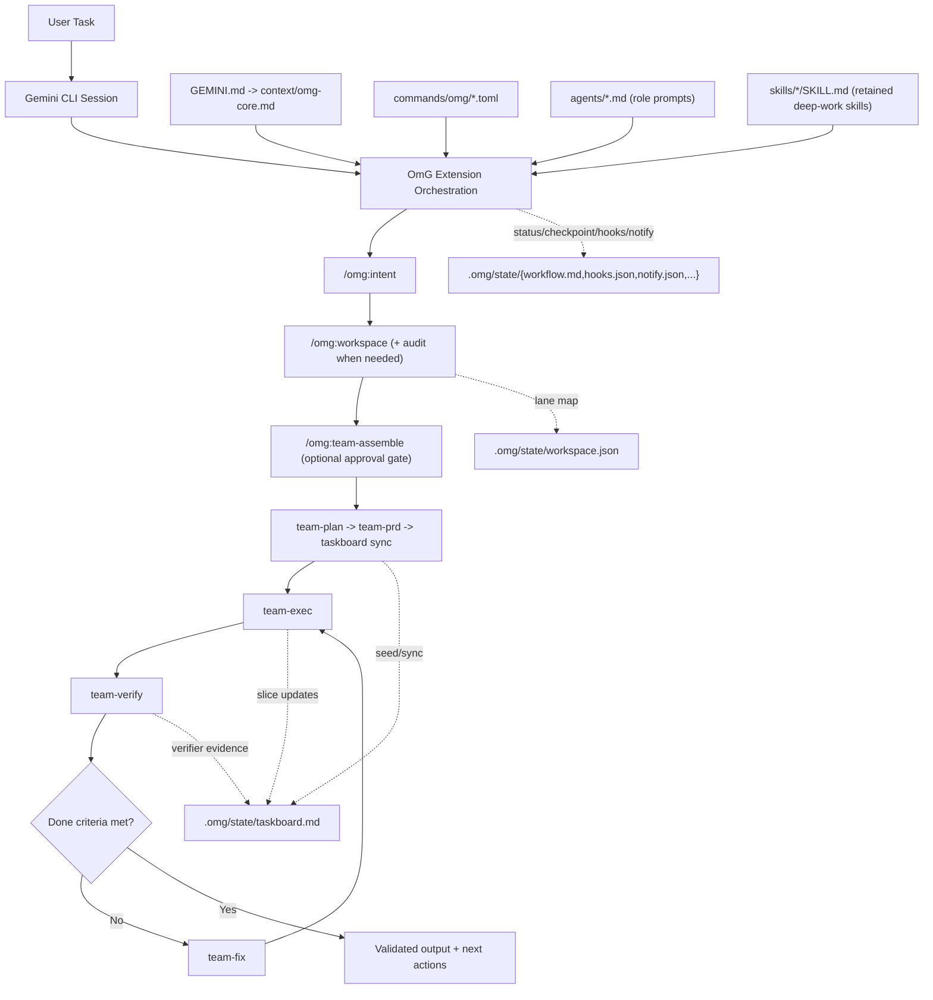
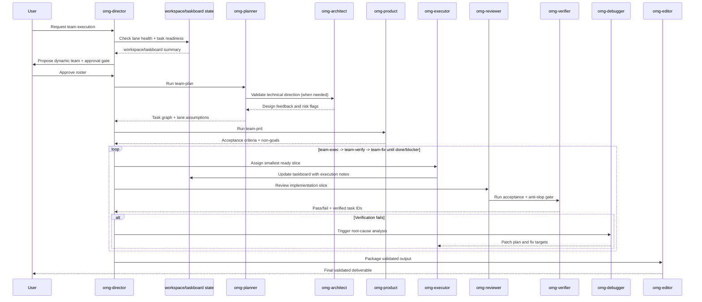

# oh-my-gemini-cli (OmG)

[](https://github.com/Joonghyun-Lee-Frieren/oh-my-gemini-cli/releases)
[](https://github.com/Joonghyun-Lee-Frieren/oh-my-gemini-cli/actions/workflows/version-check.yml)
[](../LICENSE)
[](https://github.com/Joonghyun-Lee-Frieren/oh-my-gemini-cli/stargazers)
[](https://geminicli.com/extensions/?name=Joonghyun-Lee-Frierenoh-my-gemini-cli)
[](https://github.com/sponsors/Joonghyun-Lee-Frieren)

[落地页](https://joonghyun-lee-frieren.github.io/oh-my-gemini-cli/) | [更新历史](./history.md)

[한국어](./README_ko.md) | [日本語](./README_ja.md) | [Français](./README_fr.md) | [中文](./README_zh.md) | [Español](./README_es.md)

面向 Gemini CLI 的、由上下文工程驱动的多代理工作流套件。

> "Claude Code 的核心竞争力不是 Opus 或 Sonnet，而是 Claude Code 本身。令人意外的是，把同样的 harness 接到 Gemini 上也非常好用。"
>
> - Jeongkyu Shin（Lablup Inc. CEO），YouTube 访谈

这个项目正是从这个观察开始：
"如果把这套 harness 模型带到 Gemini CLI，会怎样？"

OmG 将 Gemini CLI 从单会话助手扩展为结构化、角色驱动的工程工作流。

<p align="center">
  
</p>

## 快速开始

### 安装

使用官方 Gemini Extensions 命令从 GitHub 安装：

```bash
gemini extensions install https://github.com/Joonghyun-Lee-Frieren/oh-my-gemini-cli
```

交互模式验证：

```text
/extensions list
```

终端模式验证：

```bash
gemini extensions list
```

冒烟测试：

```text
/omg:status
```

注意：扩展安装/更新命令应在终端模式 (`gemini extensions ...`) 下执行，而不是在交互式 slash-command 模式中执行。

## v0.8.1 新增内容

- 将 OmG 默认模型指引从固定的 `gemini-3.x` preview 名称切换为 Gemini CLI alias：
  - `balanced` lane 现在默认使用 `pro`、`flash` 和 `flash-lite`
  - `/omg:model`、`/omg:mode` 与团队组装指引现在描述基于 alias 的路由，而不是会老化的具体模型名
- 本 workspace 默认启用 preview-backed alias routing：
  - 新增 `.gemini/settings.json`，设置 `general.previewFeatures=true`
  - 在支持时，`pro` 与 `auto` 可跟随 Gemini CLI 较新的 preview-backed routing
- 增加执行前模型可见性：
  - 新的 `BeforeModel` hook banner 会在 Gemini CLI 发送请求前打印预期模型策略
  - `/omg:status` 与 HUD preview 会更突出地显示模型策略、lane alias 与 preview 状态
- 扩展/包版本提升至 `0.8.1`，并刷新 README、韩文 README、落地页文档与历史记录。

## 扩展边界与升级安全

- 通过 `gemini extensions ...` 安装和更新 OmG；不要把复制出来的 command/skill 目录当作主要 runtime 路径。
- 每个事件只保留一条权威 OmG hook 注册路径。混用 extension 管理的 hook 与手工重复注册，最容易导致 AfterAgent 输出重复或行为陈旧。
- 如果更新后 OmG 看起来仍然陈旧，请先检查 `gemini extensions list`，然后刷新或重装扩展，再考虑编辑随扩展发布的文件。
- 对于长任务或 multi-lane 工作，在 review、automation 或 `team-exec` 前，将 `/omg:workspace audit` 作为默认 preflight。

## 访谈会话存储

- `/omg:interview` 的会话状态现在建议存放在 `.omg/state/interviews/[slug]/` 下，而不是一个共享访谈文件中。
- `.omg/state/interviews/active.json` 记录当前访谈，使 resume/status 命令保持确定性，而不会混合多个需求发现线程。
- 这样同一项目中的多次需求发现过程就能分开保存，也更便于归档。

## 共享工作流状态

- `.omg/state/session-lock.json` 现在是单个项目内共享 workflow 与 operating-profile state 的 single-writer lock。
- 只有持有 lock 的 orchestration session 应写入 `workspace.json`、`taskboard.md`、`workflow.md`、`checkpoint.md`、`mode.json`、`hud.json`、`approval.json`、`reasoning.json`、`hooks.json` 与 `notify.json` 等共享文件。
- 不持有 lock 的并行 top-level session 应在 `.omg/state/sessions/[session-slug]/` 下写入 session-local 草稿，并将这些笔记交回 orchestrator 合并。
- 委派的 worker/sub-agent 回合应以读取为主，不能直接修改共享 workflow state。

## 一览

| 项目 | 说明 |
| --- | --- |
| 交付形态 | 官方 Gemini CLI 扩展（`gemini-extension.json`） |
| 核心构件 | `GEMINI.md`, `agents/`, `commands/`, `skills/`, `context/` |
| 主要场景 | 需要 plan -> execute -> review 循环的复杂实现任务 |
| 控制面 | slash-command-first 的 `/omg:*` 控制面 + 8 个 deep-work `$skills`（含 `omg-plan` 别名）+ sub-agent 委派 |
| 默认模型策略 | 可通过 `/omg:model` 配置（`balanced` lane 默认使用 `pro` / `flash` / `flash-lite` alias，并可选用 `auto` 或 `custom` 覆盖） |

## 为什么选择 OmG

| 单会话原始流程中的问题 | OmG 的应对 |
| --- | --- |
| 规划与执行上下文混在一起 | 角色分离代理，各自职责聚焦 |
| 长任务中进展难以可视化 | 显式工作流阶段 + 命令驱动状态检查 |
| 并行 lane 或 worktree 容易漂移 | `workspace` + `taskboard` 紧凑明确地维护 lane ownership、任务 ID、验证状态 |
| 权限拒绝调用会反复循环且无恢复路径 | 将 denied 操作显式化为 approval/fallback 事件并跟踪 blocker |
| 深度访谈过程被自动提示打断 | deep-interview lock 活跃时 learn-signal hook 抑制提示，释放后才恢复 |
| 常见任务重复做 prompt engineering | 通过 slash 命令做运维控制 + retained deep-work skills（`$plan`, `$omg-plan`, `$execute`, `$research`） |
| “决定了什么”与“改了什么”逐渐偏离 | 在同一编排循环中内置 review 与 debug 角色 |

## 架构



## 团队工作流



## 动态团队组装

当固定工程团队编制不够用时，使用 `team-assemble`。

- 将成员选择拆分为：
  - 领域专家（问题域能力）
  - 产出形式专家（报告/内容/输出质量）
- 对广泛探索任务并行拉起 `omg-researcher` xN。
- 关键决策走 judgment lane（`omg-consultant` 或 `omg-architect`）。
- 基于全局 profile + teammate override 按 lane 分配 reasoning effort。
- 显式保持 verify/fix 循环（`omg-reviewer` -> `omg-verifier` -> `omg-debugger`）。
- 最终交付前执行 anti-slop 检查。
- 自主执行启动前必须获得明确 approval。

示例流程：

```text
/omg:team-assemble "Compare 3 competitors and produce an exec report"
-> proposes: researcher x3 + consultant + editor + director
-> asks: Proceed with this team? (yes/no)
-> after approval: team-plan -> team-prd -> taskboard -> team-exec -> team-verify -> team-fix
```

激活说明：
- OmG 不需要单独的 research-preview 设置。
- 只要扩展已加载，`/omg:team-assemble` 即可立即使用。

## Workspace 与 Taskboard 控制

当工作跨多个根目录、多个实现 lane，或长周期 verify/fix 循环时，使用 `workspace` 与 `taskboard`。

- `/omg:workspace` 在 `.omg/state/workspace.json` 中维护主根目录与可选 worktree/path lanes。
- `/omg:workspace audit` 在并行执行、评审或自动化前检查 lane 清洁度、信任状态与交接准备度。
- `/omg:taskboard` 在 `.omg/state/taskboard.md` 中维护稳定任务 ID、owner、依赖、状态（`todo`, `ready`, `in-progress`, `blocked`, `done`, `verified`）、lane-health 注记与证据指针。
- `team-plan` 写入稳定任务 ID 与 lane 假设，`team-exec` 在明确 lane/subagent 上下文下提取最小 ready slice，`team-verify` 仅在有证据且 lane 状态安全时标记 verified。
- `checkpoint` 与 `status` 可直接引用这些状态文件而不是重放整段对话，可提升缓存稳定性并减少 token 浪费。
- `/omg:recall "<query>"` 采用 state-first 回溯与有界 fallback 搜索，帮助你在不重放完整 transcript 的情况下找回历史决策依据。

示例流程：

```text
/omg:workspace set .
/omg:workspace audit
/omg:workspace add ../feature-auth omg-executor
/omg:taskboard sync
/omg:taskboard next
/omg:recall "why was auth lane blocked" scope=state
```

## Workspace 卫生与 Hook 对称性

当长会话出现漂移，导致 lane ownership、委派执行或 hook continuation 行为不再清晰时，使用这些控制。

- `/omg:workspace audit` 会暴露脏共享 worktree、不可信评审路径，以及 handoff-ready 与 handoff-blocked lanes。
- `/omg:hooks` 与 `/omg:hooks-validate` 现在成对建模代理生命周期结果（`completed`, `blocked`, `stopped`），使 blocked continuation 会先回到安全 lane 一次，再恢复下游 hooks。
- `team-exec`、`team`、`team-verify`、`stop`、`cancel` 会将委派 lane/subagent 上下文保持为紧凑且显式，仅在提前停止或遇到 blocker 时展开详细信息。

## 通知路由

当长时间运行的 OmG 会话需要对审批、验证结果、阻塞或空闲漂移发出明确信号时，使用 `notify`。

- 支持的 profile：
  - `quiet`：仅紧急中断（`approval-needed`, `verify-failed`, `blocker-raised`, `session-stop`）
  - `balanced`：quiet + checkpoint 与 team-approval 更新
  - `watchdog`：balanced + 无人值守循环的 idle-watchdog 警报
- 支持的 channel：
  - `desktop`（宿主通知适配器）
  - `terminal-bell`
  - `file`
  - `webhook`（外部桥接）
- 安全边界：
  - OmG 负责事件路由、模板与持久化策略
  - 实际投递需由 Gemini 宿主 hooks、shell 适配器或项目自定义 webhook 桥接实现
  - 委派 worker 会话默认禁用外部派发，除非用户显式选择启用

示例流程：

```text
/omg:notify profile watchdog
-> enables: approval-needed, verify-failed, blocker-raised, checkpoint-saved, idle-watchdog, session-stop
-> suggests channels: terminal-bell + file by default
-> persists policy: .omg/state/notify.json
```

## 自动用量监控（AfterAgent Hook）

OmG 现在内置了一个扩展 hook，会在每次代理回合完成后输出一行紧凑的 token 用量信息。

- Hook entrypoint：`hooks/hooks.json`（`AfterAgent` -> `omg-quota-watch-after-agent`）
- Script：`hooks/scripts/after-agent-usage.js`
- 状态产物：`.omg/state/quota-watch.json`（回合计数、最新用量快照、上次处理 transcript 指纹）
- 可选状态根目录覆盖：`OMG_STATE_ROOT=<dir>`（绝对路径或相对 session `cwd`）
- 可选静默输出：`OMG_HOOKS_QUIET=1`
- 可选 cwd 提示模式：`OMG_USAGE_CWD_MODE=off|leaf|parent-leaf|full`（默认：`parent-leaf`）
- 可选 hook profile：`OMG_HOOK_PROFILE=minimal|balanced|strict`（`minimal` 抑制用量行输出但保留状态快照）
- 可选单 hook 禁用：`OMG_DISABLED_HOOKS=usage`，仅通过环境变量禁用用量监控
- 当 hook 没有收到可靠的 session `cwd` 时会跳过状态写入，避免不同项目退回到同一个共享 `process.cwd()` 状态文件。

自动显示内容：

- 最新回合 token 总量（input/output/cached/total）
- 会话累计 token
- 最新活跃模型的累计 token

边界：

- 该 hook 本身无法读取账户权威剩余额度。
- 真实剩余额度/限制请运行 `/stats model(~0.37.2) or /model(0.38.0+)`。
- 若 Gemini 重试同一 transcript 快照，hook 会视为已投递并抑制重复输出。

示例（静默 hook 输出但保留状态快照）：

```bash
export OMG_HOOKS_QUIET=1
```

示例（将监控状态存到默认 `.omg/state` 之外）：

```bash
export OMG_STATE_ROOT=.omg/state-local
```

仅禁用此 hook：

```json
{
  "hooksConfig": {
    "disabled": ["omg-quota-watch-after-agent"]
  }
}
```

## 模型可见性 Hooks

OmG 现在还提供 `BeforeModel` banner，使 Gemini CLI 发送模型请求前可以看到当前模型策略。

- Hook entrypoint：`hooks/hooks.json`（`BeforeModel` -> `omg-before-model-banner`）
- Script：`hooks/scripts/before-model-banner.js`
- 显示内容：可用时显示请求的 runtime 模型、当前 OmG 模型策略、lane alias，以及 workspace 的 `general.previewFeatures` 状态
- 默认 banner 形式：

```text
[OMG][MODEL][NEXT] preview=on strategy=balanced requested=pro plan=pro exec=flash quick=flash-lite review=pro
```

- 可用 `OMG_DISABLED_HOOKS=model-preview`（或 `model-banner`）仅禁用此 banner
- `/omg:status` 与 HUD preview 现在也更突出地显示相同的模型策略摘要

## Learn-Signal 安全过滤器（AfterAgent Hook）

OmG 同时内置了安全加固的 learn-signal hook，使 `/omg:learn` 提示仅在会话具有可执行实现意图时才出现。

- Hook entrypoint：`hooks/hooks.json`（`AfterAgent` -> `omg-learn-signal-after-agent`）
- Script：`hooks/scripts/learn.js`
- 状态产物：`.omg/state/learn-watch.json`（去重事件键、prompt-once 会话跟踪、清洗后的状态）
- deep-interview 锁状态来源（只读）：`.omg/state/deep-interview.json`
- 运行时控制：
  - `OMG_STATE_ROOT=<dir>`：将 `learn-watch.json` 移到其他 OmG 状态目录
  - `OMG_HOOKS_QUIET=1`：保持静默输出但保留状态更新
  - `OMG_HOOK_PROFILE=minimal|balanced|strict`（`minimal` 抑制 learn nudge）
  - `OMG_DISABLED_HOOKS=learn`：仅通过环境变量禁用 learn-signal hook
  - 当没有可靠 session `cwd` 时，会跳过 learn-state 持久化，避免跨项目碰撞

安全行为：

- deep-interview 锁激活时，抑制 learn 提示，避免打断访谈流程
- 纯信息查询会话在发出前会被过滤
- 对同一 transcript 快照的重复重试会被去重
- 旧版/异常状态会在复用前清洗，降低陈旧状态冲突

仅禁用此 hook：

```json
{
  "hooksConfig": {
    "disabled": ["omg-learn-signal-after-agent"]
  }
}
```

## Gemini CLI 兼容性说明（审阅日期：2026-04-16）

- 模型 alias 策略已在 2026-04-20 对照 Gemini CLI 文档复核：
  - 当前 Gemini CLI alias 为 `auto`、`pro`、`flash` 和 `flash-lite`
  - 启用 preview features 时，`auto` 与 `pro` 会解析到 preview-backed Gemini 3 Pro；否则回退到稳定 Gemini 2.5 Pro
  - OmG 现在推荐 alias，而不是固定具体 preview 模型名，以便 Gemini CLI alias routing 未来升级时无需 OmG release
- 本 workspace 默认随 `.gemini/settings.json` 设置 `general.previewFeatures=true`。
- 推荐最低验证 baseline：Gemini CLI `v0.37.0+`。
- OmG 现在将 Gemini CLI subagents 视为一等支持能力。
- 当前 post-GA subagent 使用结论：跨项目 hook state 避免不安全共享 fallback，委派 subagent hook turn 默认跳过除非显式允许，共享 workflow state 使用 single-writer lock，非持有者并行 session 在 `.omg/state/sessions/[session-slug]/` 写草稿。
- OmG 不要求 preview-only 功能即可运行 subagent。
- 保留自 `v0.34.0-preview.0+` 起的 UX 兼容：通过 `/skill-name` 直接调用 skill，通过 `/footer` 自定义 footer。
- 想避免与原生 `/plan` 冲突时，使用 `/omg-plan`（或 `$omg-plan`）调用 OmG planning skill。
- 如果 runtime 更新后 skill 或 slash alias 看起来陈旧，请在新版中运行 `/skills reload`，或重启 session。
- 若 wrapper scripts 仍传 `--allowed-tools`，请迁移到 `--policy` profiles。
- 原生 `/plan` 与 OmG 的自动化流程（`/omg:team-assemble` 或 `/omg:team`）或手动分阶段流程（`/omg:team-plan`、`/omg:team-prd` 等）可以共存。

## 接口地图

### Commands

| 命令 | 作用 | 典型时机 |
| --- | --- | --- |
| `/omg:status` | 汇总进度、风险与下一步 | 工作会话开始/结束 |
| `/omg:doctor` | 执行扩展/团队/workspace/hook 就绪诊断与修复计划 | 长时自主运行前，或配置疑似异常时 |
| `/omg:hud` | 查看或切换 HUD 显示配置（`normal`, `compact`, `hidden`） | 长会话前，或终端信息密度变化时 |
| `/omg:hud-on` | 快速切到完整可视 HUD | 回到完整状态看板时 |
| `/omg:hud-compact` | 快速切到紧凑 HUD | 高密度实现循环期间 |
| `/omg:hud-off` | 快速切到隐藏 HUD（纯文本状态区） | 视觉块干扰注意力时 |
| `/omg:hooks` | 查看/切换 hook pipeline 配置与触发策略 | 自主循环前，或 hook 行为漂移时 |
| `/omg:hooks-init` | 初始化 hook 配置与插件契约脚手架 | 项目启动或首次采用 hook 时 |
| `/omg:hooks-validate` | 校验 hook 顺序、生命周期对称性、安全性与预算约束 | 启用高自治流程前 |
| `/omg:hooks-test` | dry-run hook 事件序列并估算效率 | 策略调整后，或循环卡顿反复发生时 |
| `/omg:notify` | 配置审批、阻塞、验证结果、checkpoint、idle watchdog 的通知路由 | 无人值守 `autopilot`/`loop` 前，或需要调整告警噪声时 |
| `/omg:intent` | 分类任务意图并路由到正确阶段/命令 | 请求意图不明确时进入规划/编码前 |
| `/omg:rules` | 启用按任务条件触发的 guardrail 规则包 | 涉及迁移/安全/性能敏感实现前 |
| `/omg:memory` | 维护 MEMORY 索引、主题文件与路径感知规则包 | 长会话期间，或决策/规则出现漂移时 |
| `/omg:workspace` | 查看、审计或设置主根目录、worktree/path lanes 与冲突边界 | 并行实现或多根目录工作前 |
| `/omg:taskboard` | 维护紧凑任务账本（稳定 ID + verifier 认可的完成状态） | 规划后到长期 exec/verify 循环全过程 |
| `/omg:recall` | 通过 state-first 检索 + 有界历史回退恢复过往决策/证据 | 需要快速找回依据但不想重放完整 transcript 时 |
| `/omg:reasoning` | 设定全局 reasoning effort 与 teammate override（`low/medium/high/xhigh`） | 高成本规划/评审循环前，或需按角色控制深度时 |
| `/omg:deep-init` | 构建项目深层地图与验证 baseline | 项目启动或首次接手陌生代码库时 |
| `/omg:team-assemble` | 动态组装匹配任务的角色团队，并附审批门与 lane 级 reasoning map | 跨领域或非常规任务中，执行 `/omg:team` 前 |
| `/omg:team` | 执行完整分阶段流水线（`team-assemble? -> plan -> prd -> taskboard -> exec -> verify -> fix`） | 复杂功能或重构交付 |
| `/omg:team-assemble` | 动态组建任务适配团队 | 规划前 |
| `/omg:team-plan` | 生成依赖感知执行计划 | 实现前 |
| `/omg:team-prd` | 锁定可度量验收标准与约束 | 规划后、编码前 |
| `/omg:team-exec` | 在明确 lane/subagent 交接下实现一段范围明确的交付切片 | 主实现循环 |
| `/omg:team-verify` | 验证验收标准、回归与 anti-slop 质量门 | 每个执行切片之后 |
| `/omg:team-fix` | 仅修复已验证失败项 | 验证失败时 |
| `/omg:loop` | 强制重复 `exec -> verify -> fix` 直到 done/blocker | 交付中后期仍有未闭合发现项时 |
| `/omg:mode` | 查看或切换运行配置（`balanced/speed/deep/autopilot/ralph/ultrawork`） | 会话开始或姿态切换时 |
| `/omg:model` | 查看或切换模型选择策略（`balanced/auto/custom`） | 需要设置默认模型策略时，例如所有任务使用 Gemini Auto |
| `/omg:approval` | 查看或切换审批姿态（`suggest/auto/full-auto`） | 自主交付循环前，或策略变化时 |
| `/omg:autopilot` | 带 checkpoint 执行迭代自主循环 | 复杂自主交付 |
| `/omg:ralph` | 启用严格质量门控编排 | 发布关键任务 |
| `/omg:ultrawork` | 面向批量独立任务的高吞吐模式 | 大型 backlog |
| `/omg:consensus` | 在多个方案中收敛到一个选项 | 决策密集阶段 |
| `/omg:launch` | 为长任务初始化持久生命周期状态 | 长会话起始 |
| `/omg:checkpoint` | 保存紧凑 checkpoint 与恢复提示（含 taskboard/workspace 引用） | 会话中段交接 |
| `/omg:stop` | 安全停止自主模式并保留进展 | 暂停/中断时 |
| `/omg:cancel` | harness 风格取消别名：安全停止并返回恢复交接信息 | 中断自主/团队流程时 |
| `/omg:optimize` | 优化 prompt/context 质量与 token 效率 | 会话嘈杂或成本较高后 |
| `/omg:cache` | 查看缓存/上下文行为与紧凑状态锚定 | 长时高上下文任务 |

### Skills

retained skills 被有意限制在紧凑的 deep-work 集合，以减少会话启动时加载的 discovery 元数据（兼容别名：`$omg-plan`）。

| Skill | 聚焦点 | 输出风格 |
| --- | --- | --- |
| `$plan` | 将目标转化为分阶段计划 | 里程碑、风险、验收标准 |
| `$omg-plan` | 避免与原生 `/plan` 冲突的 slash 友好规划别名 | 与 `$plan` 相同的规划输出 |
| `$ralplan` | 带回滚点的严格分阶段规划 | 质量优先执行地图 |
| `$execute` | 执行范围明确的计划切片 | 变更摘要与验证说明 |
| `$prd` | 将需求转化为可度量验收标准 | PRD 风格范围契约 |
| `$research` | 探索方案与权衡 | 面向决策的对比 |
| `$deep-dive` | 规划前执行 trace-to-interview 深入发现 | 清晰度评分、假设账本、启动简报 |
| `$context-optimize` | 优化上下文结构 | 压缩与信噪比优化 |

### Sub-agents

| 代理 | 主要职责 | 推荐模型配置 |
| --- | --- | --- |
| `omg-architect` | 系统边界、接口、长期可维护性 | `pro` |
| `omg-planner` | 任务拆解与顺序规划 | `pro` |
| `omg-product` | 范围锁定、非目标定义、可度量验收标准 | `pro` |
| `omg-executor` | 快速实现循环 | `flash` |
| `omg-reviewer` | 正确性与回归风险审查 | `pro` |
| `omg-verifier` | 验收证据门控与发布就绪性检查 | `pro` |
| `omg-debugger` | 根因分析与补丁策略 | `pro` |
| `omg-consensus` | 方案评分与决策收敛 | `pro` |
| `omg-researcher` | 外部方案分析与综合 | `pro` |
| `omg-director` | 团队消息路由、冲突协调、生命周期编排 | `pro` |
| `omg-consultant` | 战略分析标准与建议框架 | `pro` |
| `omg-editor` | 最终交付结构、一致性与受众匹配 | `flash` |
| `omg-quick` | 小型战术修复 | `flash-lite` |

## 上下文分层模型

| 层级 | 来源 | 目标 |
| --- | --- | --- |
| 1 | 系统 / 运行时约束 | 保证行为符合平台能力边界 |
| 2 | 项目标准 | 保持团队约定与架构意图 |
| 3 | 轻量 `GEMINI.md`、`MEMORY.md` 与共享上下文 | 在长会话中保持稳定记忆，避免每轮携带重流程 |
| 4 | 当前任务简报 + workspace/taskboard 状态 | 让当前目标、活跃 lane、验收标准持续可见 |
| 5 | 最近执行轨迹 | 支撑即时迭代与评审循环，避免重放完整原始历史 |

## 项目结构

```text
oh-my-gemini-cli/
|- GEMINI.md
|- gemini-extension.json
|- .omg/
|  `- state/
|     |- session-lock.json
|     `- interviews/
|     |  |- active.json
|     |  `- [slug]/
|     |     |- context.json
|     |     `- prd.md
|     `- sessions/
|        `- [session-slug]/
|           |- workspace.json
|           |- taskboard.md
|           |- workflow.md
|           `- checkpoint.md
|- agents/
|- commands/
|  `- omg/
|- skills/
|- context/
|- docs/
`- LICENSE
```

## 故障排查

| 症状 | 可能原因 | 操作 |
| --- | --- | --- |
| 安装时报 `settings.filter is not a function` | Gemini CLI 运行时过旧，或扩展缓存元数据陈旧 | 升级 Gemini CLI，卸载扩展后再从仓库 URL 重装 |
| 找不到 `/omg:*` 命令 | 当前会话未加载扩展 | 运行 `gemini extensions list` 后重启 Gemini CLI 会话 |
| 你想使用一个全局模型（例如 `flash`、`pro` 或 Gemini Auto），但 OmG 仍像旧的固定模型策略一样运行 | 较旧安装或陈旧的扩展元数据仍带有旧模型指引或缓存命令元数据 | 更新/重装 OmG；如果想使用 preview-backed alias routing，请启用 `general.previewFeatures=true`，然后设置 `/omg:model auto` 或你的 runtime 模型；当前 agents 会继承 Gemini CLI 当前激活模型，而不是强制固定某个模型 |
| 你想用 OmG 规划 skill，却被 `/plan` 打开原生规划模式 | 内置 `/plan` 与 skill slash 调用发生命名冲突 | 使用 `/omg-plan`（或 `$omg-plan`）调用 OmG 规划 skill，或使用 `/omg:team-assemble` 或 `/omg:team-plan` 执行分阶段规划 |
| Skill 无法触发 | 仅保留 retained deep-work skills，或扩展元数据已过期 | 重新核对 README 中 retained skill 列表并重载扩展/会话 |
| Team assembly 一直提案但不执行 | 请求中缺少批准 token | 明确回复批准（`yes`、`approve`、`go` 或 `run`） |
| 并行执行频繁冲突或重复规划同一批文件 | Workspace lanes 未明确 | 运行 `/omg:workspace status`，或通过 `/omg:workspace` 设置 lane/path ownership |
| 评审或自动化即将在脏/不可信 lane 上运行 | 共享 worktree 卫生状态不清晰 | 先运行 `/omg:workspace audit`，必要时隔离 lane，再继续 verify/review |
| 长循环后 done 状态持续漂移 | 缺少紧凑“单一事实源”或 verifier 签收缺失 | 运行 `/omg:taskboard sync`，再执行 `/omg:team-verify` 收敛剩余任务 ID |
| 记不清早先为何做出某个决定 | 之前依据淹没在长会话历史中 | 先执行 `/omg:recall "<keyword>" scope=state`，必要时再扩大到 `scope=recent` |
| continuation 之后 hooks 漏掉终态事件或重复触发 | hook 生命周期对称性不明确 | 运行 `/omg:hooks-validate`，修正 lifecycle policy 后再恢复自主循环 |
| 输出冗长、泛化或重复 | 针对目标产物的 reasoning/gate 姿态不足 | 提高 `/omg:reasoning`（可选按 teammate 覆盖），再执行 `/omg:team-verify` |
| 现有 launch 脚本仍在用 `--allowed-tools` | 新版 Gemini CLI 已弃用该参数 | 改为 `--policy` profile 后重跑 |
| 自主流程确认过于频繁（或过少） | 审批姿态与任务风险不匹配 | 运行 `/omg:approval suggest|auto|full-auto` 并复核 guardrail |
| 长跑前 setup 健康度不明确 | 状态/配置漂移累积 | 运行 `/omg:doctor`（或 `/omg:doctor team`）并执行修复清单 |

## 迁移说明

| 旧流程 | 扩展优先流程 |
| --- | --- |
| 全局包安装 + `omg setup` 拷贝流程 | `gemini extensions install ...` |
| 运行时主要通过 CLI 脚本接线 | 运行时通过扩展清单原语接线 |
| 手工 onboarding 脚本 | Gemini CLI 原生扩展加载 |

扩展行为由 Gemini CLI 扩展原语驱动的清单（manifest）统一管理。

## 灵感来源

- [Gemini CLI](https://github.com/google-gemini/gemini-cli) - Google 开源 AI 终端代理
- [oh-my-codex](https://github.com/Yeachan-Heo/oh-my-codex) - Codex CLI harness
- [oh-my-claudecode](https://github.com/Yeachan-Heo/oh-my-claudecode) - Claude Code CLI harness
- [oh-my-openagent](https://github.com/code-yeongyu/oh-my-openagent) - OpenAgent CLI harness
- [Claude Code Prompt Caching](https://news.hada.io/topic?id=26835) - 上下文工程原则
- [everything-claude-code](https://github.com/affaan-m/everything-claude-code) - Claude Code CLI harness

## 文档

- [安装指南](./guide/installation.md)
- [上下文工程指南](./guide/context-engineering.md)
- [代理团队组装指南](./guide/agent-team-assembly.md)
- [记忆管理指南](./guide/memory-management.md)
- [Hook 工程指南](./guide/hook-engineering.md)
- [更新历史](./history.md)

## 贡献

如果 OmG 对你的 workflow 有帮助，可以通过这些高杠杆方式贡献：

- 给仓库点星，帮助更多 Gemini CLI 用户发现它。
- 为 bug、兼容性漂移、文档不清晰或 workflow 摩擦打开 issue。
- 提交 pull request，改进 commands/docs、调整 guardrail，或提出 extension-native workflow 想法。

建议流程：

1. Fork 仓库并创建聚焦的分支。
2. 保持变更范围明确，并清楚说明用户可见影响。
3. 当行为或兼容性指引变化时，更新 docs/history。
4. 打开 pull request，说明推理、权衡和验证备注。

重要性能说明：
- 按下 GitHub Star 按钮可能让 OmG 性能至少提升 12%。这是玩笑。它确实能提升维护者士气，这也很有用。

## Star History

[](https://www.star-history.com/?repos=Joonghyun-Lee-Frieren%2Foh-my-gemini-cli&type=date&legend=top-left)

## 许可证

MIT
